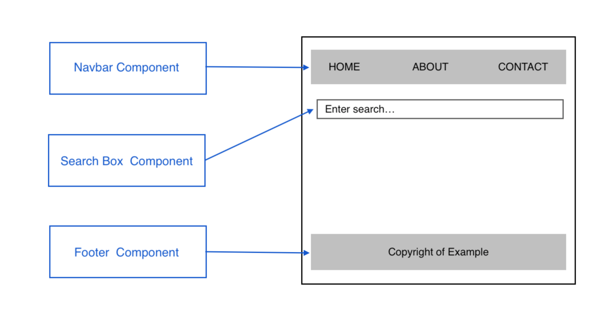
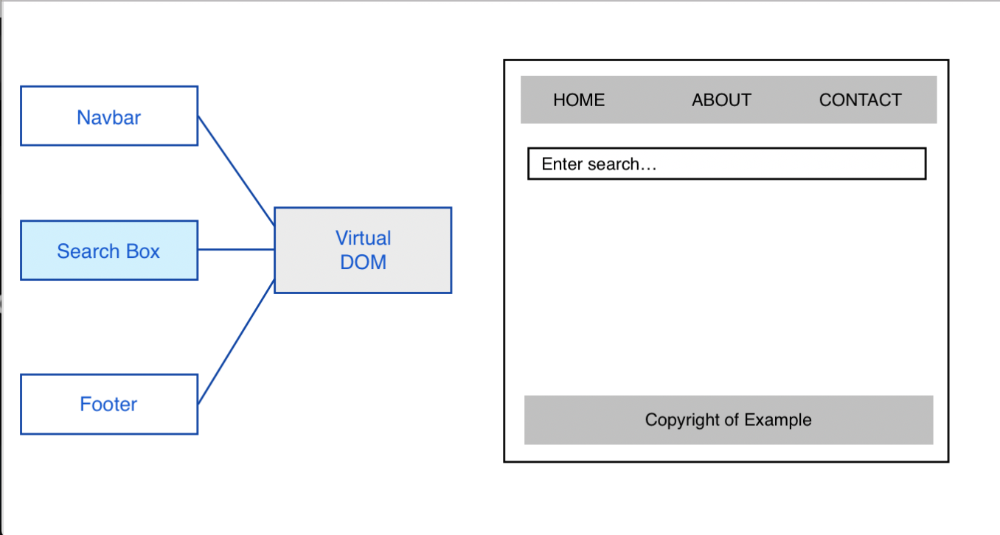
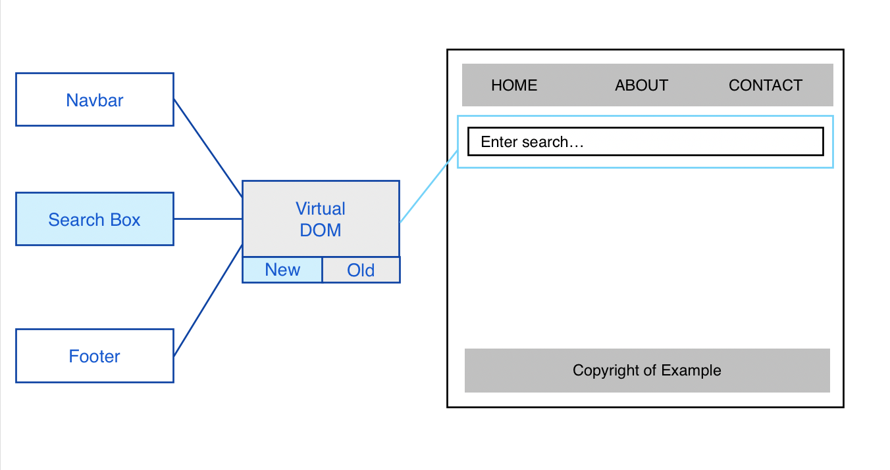

# React: Components

High level of overview of what React is and the basics of how it works in the background.

The life blood of React are **Components**. We create Components in React for different parts of our application. For example, we could have a Component for a Navbar, Search Box and Footer. Then, it's React's job to take those Components and inject them into the DOM, so we we can see it on the web application. Again, the DOM is the Document Object Model.

<kbd></kbd>

## How does React do this? - Virtual DOM

It takes all of the Components and it creates a JavaScript representation of the DOM, that's called the **Virtual DOM**. It takes that Virtual DOM and renders it to the Browser and creates the actual DOM based on it, and that's how we see all the different components.

The purpose here, is that everytime we need to make a change to one of these Components, like the UI state in these Components, React is gonna look at that change and update the DOM. It does it quickly because of the Virtual DOM.

So we have the Virtual DOM in the background.

<kbd></kbd>

When we make a change to the Search Box, for example, in the **state** of that Component, then we need to reflect that change on the Browser. So what happens is that we create a **New Virtual DOM** via React in the background and it'll compare it toth **Old Virtual DOM** that it created a few seconds ago when it first rendered it to the Browser.

<kbd></kbd>

We can see the differences in the Virtual DOM and it knows exactly where to update in the DOM, and it'l only update that one part instead of the whole thing.

This cycle happens everytime one of our Component's **state** or **data** changes. It's constantly updating in the DOM.

## How are these Components made? What do they look like?

* Components looks like HTML templates, but they're not HTML, they're actually **JSX** (JavaScript XML)
* They can contain a **state** which is the ```data``` or ```UI state``` of the web application
* They can also contain JavaScript for functionality