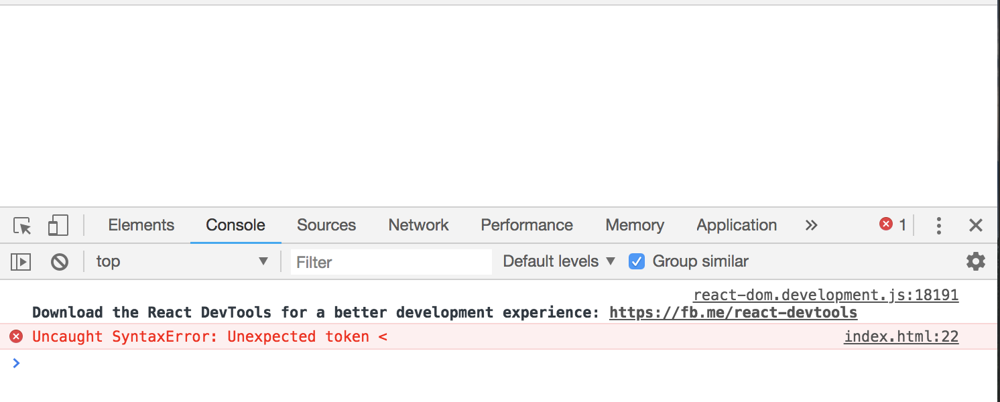
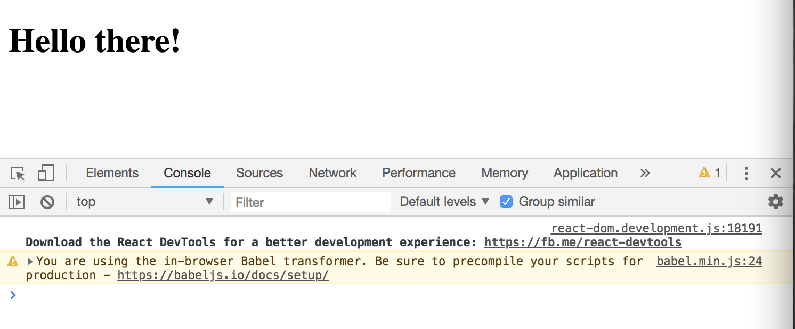
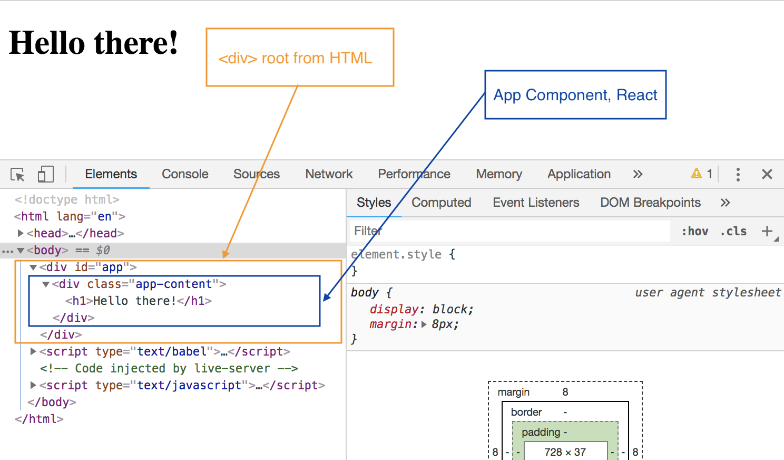

# Setting up React Project

There's a couple of different ways to get setup with React to start using it. 

* ```create-react-app``` package can be used to create a full React project, where React will control the flow of the whole application with a **Webpack** setup.
* ```React CDN``` - to quickly get up and running with React and this is good if you only want to use React to create widgets or to control small sections of a webpage. It's good when you're starting to first learn React. https://reactjs.org/docs/cdn-links.html

For React CDN, grab these two ```<scripts>```:

```
<script crossorigin src="https://unpkg.com/react@16/umd/react.development.js"></script>
<script crossorigin src="https://unpkg.com/react-dom@16/umd/react-dom.development.js"></script>
```

Next, create a new file called ```index.html``` and add those two ```<scripts>``` under the ```<meta>``` tag after you've added the HTML boilerplate.

```
<!DOCTYPE html>
<html lang="en">
<head>
  <meta charset="UTF-8">
  <meta name="viewport" content="width=device-width, initial-scale=1.0">
  <meta http-equiv="X-UA-Compatible" content="ie=edge">
  <!-- React CDN -->
  <script crossorigin src="https://unpkg.com/react@16/umd/react.development.js"></script>
  <script crossorigin src="https://unpkg.com/react-dom@16/umd/react-dom.development.js"></script>
  <title>Document</title>
</head>
<body>
  
</body>
</html>
```

The top ```<script>``` is the **Core React library**.

```
<script crossorigin src="https://unpkg.com/react@16/umd/react.development.js"></script>
```

The second, bottom one, is the **React DOM library** and this is like a glue layer between React and the DOM. It's what let's us inject our components into the DOM.

```
<script crossorigin src="https://unpkg.com/react-dom@16/umd/react-dom.development.js"></script>
```

Now, inside the ```<body>```, create a ```<div>``` tag with an ```id``` of app. This will be the ```<div>``` that we'll ultimately controlling with a React Component.

## If you're using VSCode

Add these extension packages bc it'll be very useful when you're developing your React applications:

* **ES7 React/Redux/GraphQL/React-Native snippets** - this will give us shortcuts to some snippets of code, so we can easily create Components or imports, etc.
* **Sublime Babel** - this will give us decent syntax highlighting for when we write JSX for our Component template, so it's going to look like HTML.

# How to make a React Component

Again, Components is what makes React, we use it to control different elements inside the web application, as in different sections like the Navbar, Search bar, Footer, etc.

In this example, we're gonna make a React Component to control ```<div id="app"></div>``` in our index.html.

First, we need to create that Component in JavaScript. There's different ways of making Components, in this example, we'll use **JavaScript Classes**, a Class-based Component. We'll learn other ways as well later on.

To create a Class-based Component, first, we need the ```class``` keyword. A refresher, **Classes** are a way for us to blueprint object in JavaScript. Let's make a ```class``` with the name ```App``` (it could be called whatever you want though) since we're gonna use it to control ```id=app``` in the div tag. This Class is going to ```extends``` ```React.Component```.

* ```React.Component``` - 'React' gives us access to the React Object bc we added this ```  <script crossorigin src="https://unpkg.com/react@16/umd/react.development.js"></script>``` to it and we're using 'Component' on the React Object Component to inheret all the base functionaliy of a Component into this Class. So, this ```class App``` is going to represent our Component.

Class-based Component must have inside at least one function, and that's the **render()** method.

* ```render()``` method - that is responsible for rendering our template to whatever element we want to render on to the DOM.

Next, inside the ```render()``` method, we're going to want to ```return``` a **value**, and this value is going to be our **JSX template**. Typically, this return value is going to inside ```( )``` parentheses bc most times, our return value is going to go over one.

## JSX Template

* ```JSX``` - is a way for us to write HTML code inside JavaScript bc as you can see within our ```<script>``` tag, we're working inside a JavaScript block. 

We'll write some HTML code and use JSX to do that, again, it looks like HTML, but it's actually JSX template. First, create a ```<div>``` and inside it add whatever element, for this example, let's add an ```<h1>```.

```
<body>
  <div id="app"></div>

  <script>
    class App extends React.Component {
      render() {
        return (
          <div>
            <h1>Hello there!</h1>
          </div>
        )
      }
    }
  </script>
</body>
```

There's a couple of limitations when using JSX to be aware of:
* Should always return one root element at the top, so ```<div>...</div>``` then we can nest as many elements inside that root element. (there's ways around this, but will learn it later)
* We can't use the keyword ```class``` to add CSS classes bc ```class``` in JavaScript is a reserved keyword. We have to use ```className``` instead equals to whatever. 

```
<body>
  <div id="app"></div>

  <script>
    class App extends React.Component {
      render() {
        return (
          <div className="app-content">
            <h1>Hello there!</h1>
          </div>
        )
      }
    }
  </script>

</body>
```

## Render our Component

At the moment, our code isn't doing anything. We need to **render** our React Component to ```<div id="app">```. But, currently, nothing inside our JavaScript block is telling React to do that yet. Remember, we added the second script, ```<script crossorigin src="https://unpkg.com/react-dom@16/umd/react-dom.development.js"></script>```, called **React DOM**, this is the glue layer that takes our Components and can render them to the DOM.

The way we take the Component and render it to the DOM is by saying

* ```ReactDOM```  - this is to access
* ```render()``` - use this method, pass in two parameters inside
* First parameter - which Class Component we want to render to the DOM, ie. ```App```, but we add it as a tag like JSX ```<App />```. So, we take a Component Name and put it inside a tag, which is also a self-closing tag.
* Second parameter - is where we want to render it to the DOM. In this example, we want to render it to ```<div id="app">```, so we'll say ```document.getElementById()``` and then pass in the id.

```
<body>
  <div id="app"></div>

  <script>
    class App extends React.Component {
      render() {
        return (
          <div className="app-content">
            <h1>Hello there!</h1>
          </div>
        )
      }
    }

    ReactDOM.render(<App />, document.getElementById('app'));
  </script>
</body>
```

<kbd></kbd>

When you open this index.html in the Browser, it's going to show an error bc the Browser doesn't recognixe JSx out of the box bc it's not supporter. We need a way to take this code and trasnpile it into something that is supported in browsers. Go to https://babeljs.io/ , then click on setup and grab the script in Usage section ```<script src="https://unpkg.com/babel-standalone@6/babel.min.js"></script>``` and ```type="text/babel"``` into your ```<script>``` tag.

* **Babel** - it's going to transpile our code into something that the Browser will understand.

<kbd></kbd>

Now we can see 'Hello there!' and when we inspect the element in our DevTools in Chrome, then we can see that inside the ```<div id="app">``` we're rendering our ```App``` Component. So, it doesn't get rid of the root, it just nests our Component inside that div.

<kbd></kbd>

## React for Dynamic Content!

Ok cool, but what's the point of this? We could've done it the old school way. Well, the idea of React is that we can output dynamic content, React isn't useful for static content.

So, the purpose of React is to output dynamic content inside our Components.