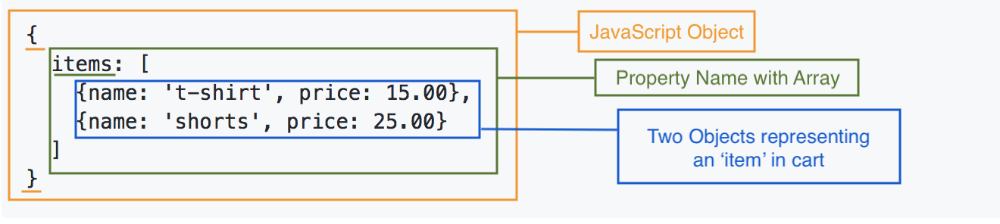
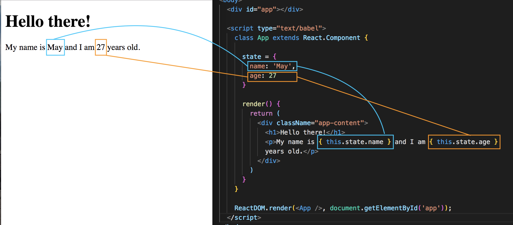

# Component State

The **state** of a Component describes the state of the Component, by that we mean (1) the state of the data or (2) the UI of a Component bc after all, our data within our applications will most of time be dynamic, constantly changing or updating over time.

* It's a JavaScript Object
* Describes the current state of the Component like data or UI state
* The state of Component can be updated over time, like the data we output can change overtime

## Example, Shopping Cart Component, data

Imagine we have some kind of Shopping Cart Component on our website. The state of the Component is just a JavaScript Object, and it looks like this:

<kbd></kbd>

* The state of this Component is just a JavaScript Object with ```{ }```
* Then, there's a property name, ```items```, which is an Array
* Inside that Array are two Objects and each Object represents and item in the shopping cart

So, this is the **state** of that Shopping Cart Component. We're storing the local data of that Component. Each ```item``` has a ```name``` and a ```price```.

Now, what if a User adds a new item to the shopping cart? Then the state would be updated to reflect that. The idea is to take this state of our Component and we're using that to output dynamically the content inside that Component.

We're keeping the **state** and the **output** on the screen in sync with each other. Again, it's a way for us to store locally, the data or UI state of the Component.

## Example, Popup Component, UI state component

It has a state with just one property on it called ```showPopup``` and given ```true``` or ```false```. If it's true, it'll show on the scree, if false, it won't. We're storing the component UI state here.

```
{
  showPopup: true
}

{
  showPopup: false
}
```

## Add some state component to our previous App Component example

There's a couple of different ways to create the state of a component. The first way we'll try out is, which is the easiest, is to define a **state property** inside the ```class App```, the Component. And we set that ```state = { }``` a JavaScript Object, which will contain some kind of data or UI state. Now, we can add our different properties inside this object. 

Let's give is a ```name``` property and a value of 'Nancy', and also an ```age``` property.

```
<body>
  <div id="app"></div>

  <script type="text/babel">
    class App extends React.Component {

      state = {
        name: 'May',
        age: 27
      }

      render() {
        return (
          <div className="app-content">
            <h1>Hello there!</h1>
            <p>Dynamically rendered: { Math.random() * 10 }</p>
          </div>
        )
      }
    }

    ReactDOM.render(<App />, document.getElementById('app'));
  </script>
</body>
```

This here is our initial ```state``` of our Component:

```
state = {
  name: 'May',
  age: 27
}
```

It could be updated over time.

## Output Dynamic Data

It's ok to have ```state``` defined in the Component, but we have to add a few more code to actually have it do something. We want to output this data to the template. Remove the previous ```<p>Dynamically rendered: { Math.random() * 10 }</p>``` and let's output the data from the state.

```
<p>My name is {  } and I am { } years old.</p>
```

Remember, to output dyanmic content/data, we need to enclose the info in ```{  }```. To reference the data, we need to say ```this``` to reference the Component itself, then we get access to the ```state``` property which refers now to the state object, and then we want the name property like ```name``` and ```age```.

<kbd></kbd>


Defining a state can be done inside a Constructor, but for this example, it's not necessary.