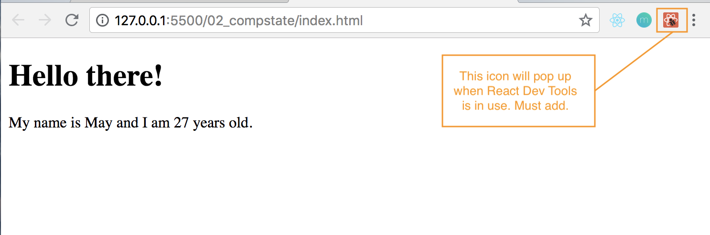
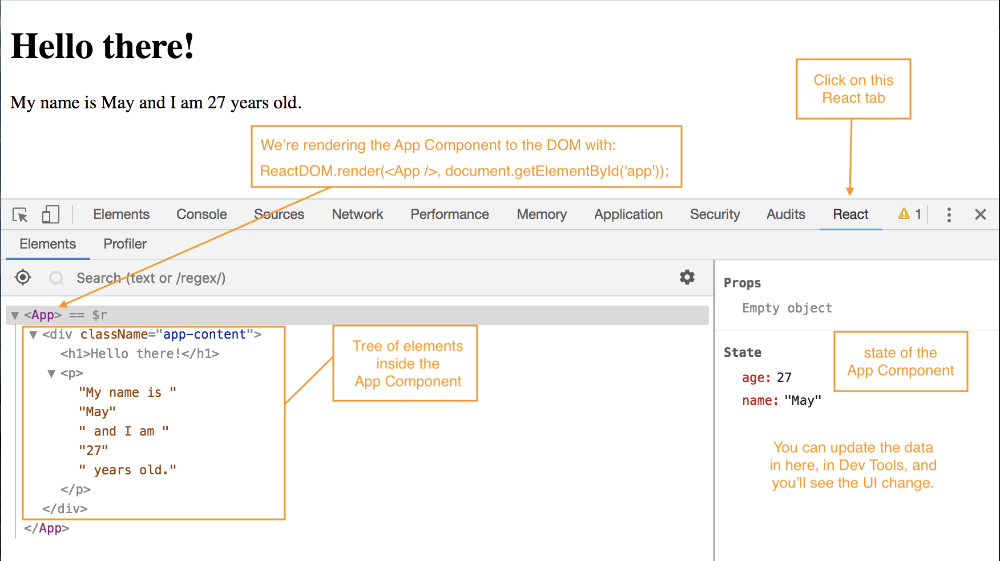
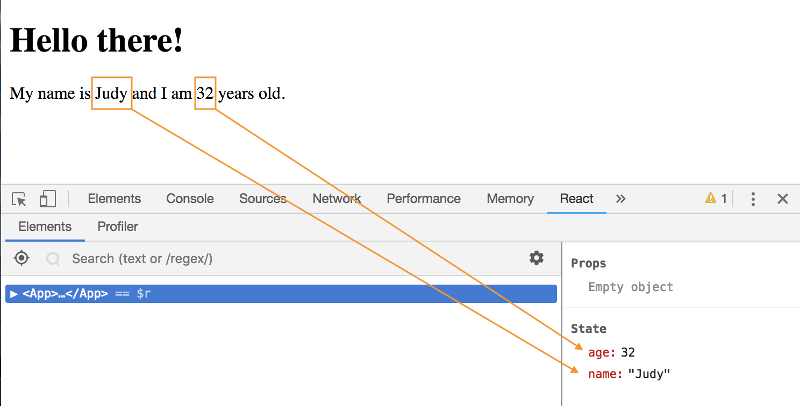
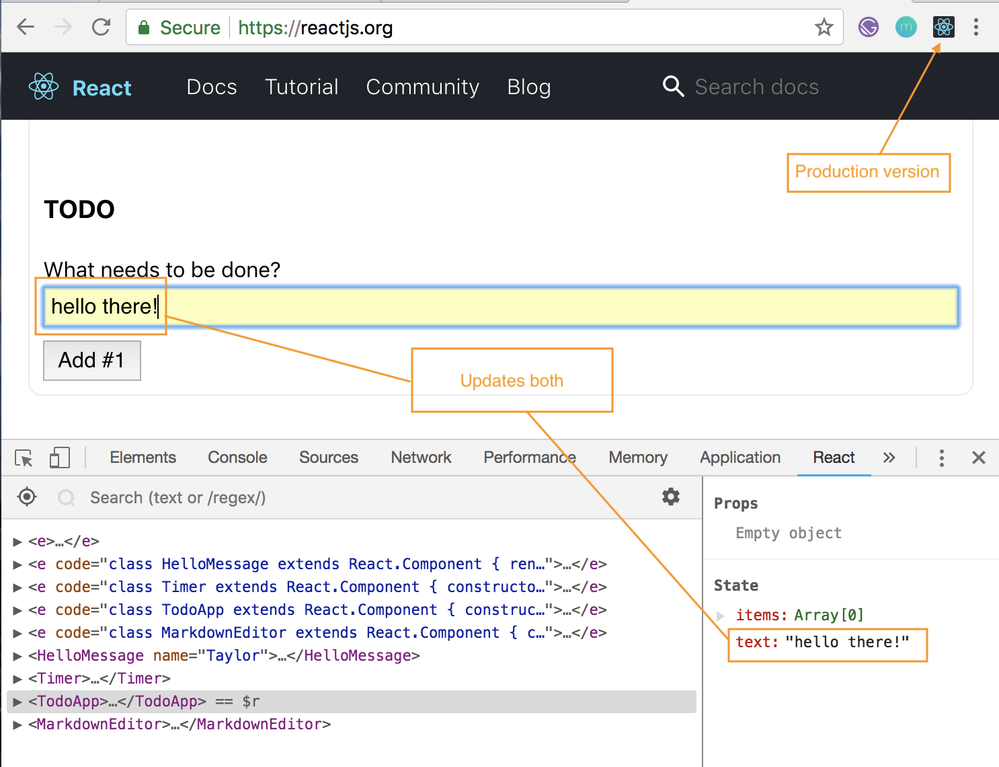

# React Dev Tools

* **React Developer Tools** - should add this extension to your Google Chrome. It'll help you keep track of the state and the different data inside your component when you're building an application. 

The icon will light up red if it's in Development version. It'll be blue and black if it's in Production version. That's why our's is red bc it's using the React development build.

<kbd></kbd>

<kbd></kbd>

You can make changes to the state data in React Dev Tools and it'll dynamically change the UI without messing with you actual code saved in your local machine. So, you can play around with the application using the React Dev Tools.

<kbd></kbd>

This tool is for Developers for you to play around with your application. A real user would not come in, pop this up and mess around. For Users, it would be more in the case like if we had a form, they User would input data, and that would change the state when we hook event listeners.

**Production Version Example**

When you go onto the https://reactjs.org/ website, you'll see that their icon is the Production version, blue and black.

<kbd></kbd>

Essentially, React Dev Tools, is a good way to interact with your Components to play around and test it out.