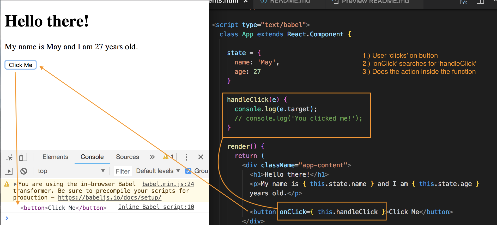
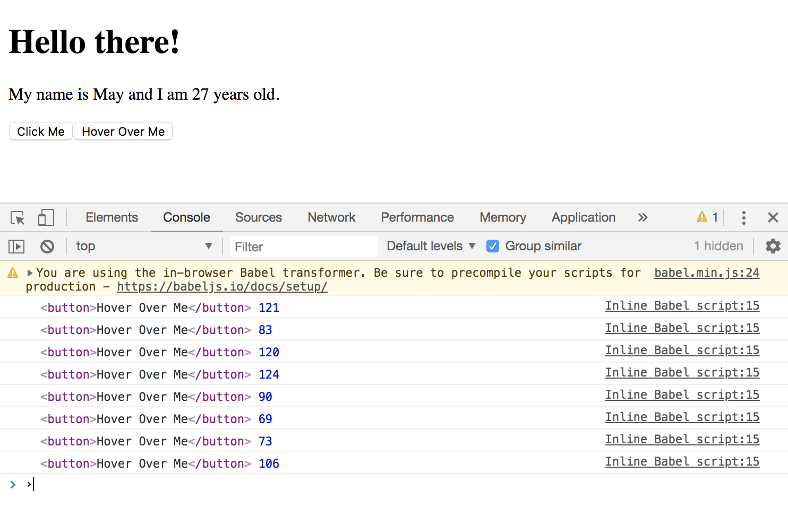
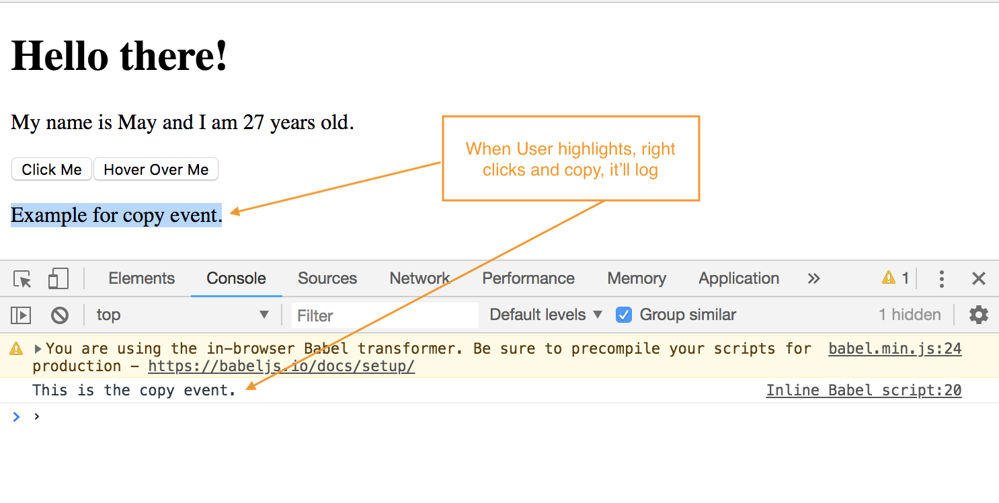

# React and DOM Events

Again, whenever we change the ```state``` of a Component, it's going to re-render to output that new state to the DOM.

In this section, we'll learn how to react to events, actions done by Users on the web page. Based on those events, change the state.

We'll start off basic and just listen to 'click' events, 'mouse' movements, etc. on the page and reacting to them.

**Link to all of the React Event Listeners:** https://reactjs.org/docs/events.html/#supported-events

## Example, ```'click'``` Event

**Inside ```render()``` function**
* First, create a button
* We want to listen for when a User clicks the button with an event listener, we'll do it with ```onClick``` set it to something with ```=``` like a function
* Then call the function in ```{  }``` and it has to have ```this``` in front of the function name bc ```this``` refers to the Component which the function is stored on.

**Define ```handleClick()``` function**
* Create and define the function inside the class above ```render()``` called ```handleClick```, we want to execute when someone click on this button. This function is going to take in the ```e``` the event object as its parameter.
* Inside it, first, test the function with ````console.log``` the ```e``` event and the property ```target``` which gets us the target element, like what the User did to cause the event, where the event is firing from, for us, it's the button.

```
...
handleClick(e) {
  console.log(e.target);
  // console.log('You clicked me!');
}

render() {
  return (
    <div className="app-content">
      <h1>Hello there!</h1>
      <p>My name is { this.state.name } and I am { this.state.age } years old.</p>

      <button onClick={ this.handleClick }>Click Me</button>  
    </div>
  )
}
```

<kbd></kbd>

## Example, ```mouseover``` Event

**Inside ```render()``` function**
* Create another button
* Add event listener for ```onMouseOver``` set it to something with ```=``` like a function
* Then call the function in ```{  }``` and it has to have ```this``` in front of the function name bc ```this``` refers to the Component which the function is stored on.

**Define ```handleMouseOver()``` function**
* Create and define the function inside the class above ```render()``` called ```handleMouseOver```, we want to execute when someone click on this button. This function is going to take in the ```e``` the event object as its parameter.
* Inside it, first, test the function with ````console.log``` the ```e``` event and the property ```target``` which gets us the target element, like what the User did to cause the event, where the event is firing from, for us, it's the button. The ```pageX``` gets the x-axis of where the User hovered over the button.

```

handleMouseOver(e) {
  console.log(e.target, e.pageX);
  // console.log('You hovered over me!');
}

<button onMouseOver={ this.handleMouseOver }>Hover Over Me</button> 

```

Everytime you over on top of this button, it'll fire the action, which in our case, the log. You can target different properties on the event object, the ```e``` that was passed into our function.

<kbd></kbd>

## Example, ```copy``` Event

**Inside ```render()``` function**
* Create a ```<p>``` tag and add some text
* Add event listener for ```onCopy``` set it to something with ```=``` like a function
* Then call the function in ```{  }``` and it has to have ```this``` in front of the function name bc ```this``` refers to the Component which the function is stored on.

**Define ```handleCopy()``` function**
* Create and define the function inside the class above ```render()``` called ```handleCopy```, we want to execute when someone click on this button. This function is going to take in the ```e``` the event object as its parameter.
* Inside it, first, test the function with ````console.log``` a text. When the User tries to right click and copy, it'll log out the action inside the function.

```
handleCopy(e) {
  console.log('This is the copy event.');
}

<p onCopy={ this.handleCopy }>Example for copy event.</p>
```

<kbd></kbd>