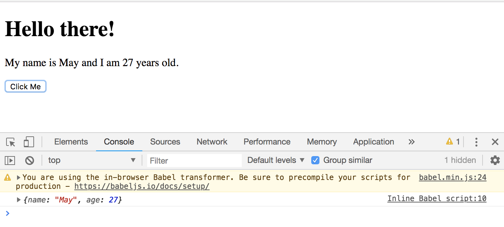
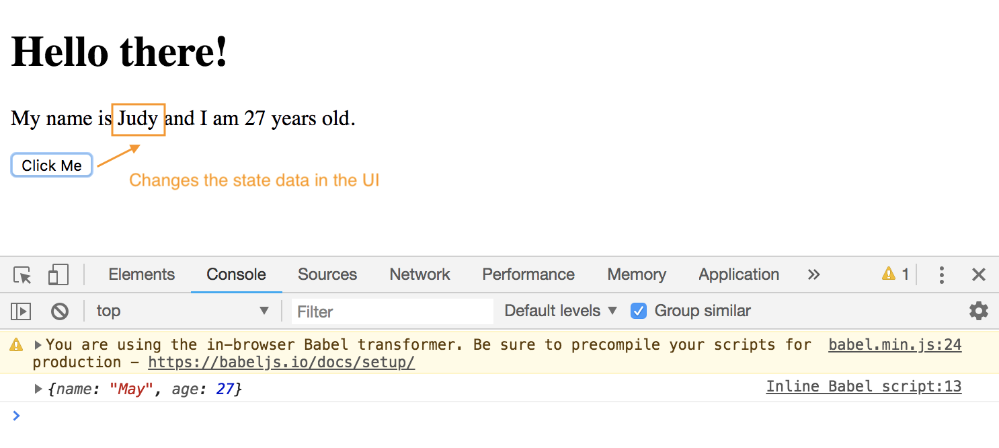

# React: Changing the ```state``` and ```this```

Why doesn't ```this.state``` in this code work?

```
handleClick(e) {
  console.log(this.state);
}
```

But it works in the ```render()``` function?

That's bc it has to do with the value of the ```this``` keyword in the different locations/scopes.

## ```'this'````

The ```this``` keyword in JavaScript, the context of it inside a function is generally determined by how and where the function is called, not by where the function is located, like top or bottom. 

Sometimes, the value of ```this``` keyword inside a function is not what you expect. You'd probably assume that the context of the ```this``` keyword one of these functions would point to our React Component instance and would be able to access ```this.state``` like in the template, but by default, when we call a function in reaction to a DOM event in the browser window like ```onClick={ this.handleClick }``` this 'click', the context of ```this``` keyowrd is lost inside the function ```console.log(this.state);``` it sets it to undefined, which is why we get undefined and an error in the console.

That's the normal behavior of JavaScript, it's not React.

**Old React**
Old versions of React bounds the context of the ```this``` keyword ```this.state``` inside the function's action of console.log to the Component instance in our functions. It did that for us in the old versions.

**New React**
When we use Class Components like in our example, then it doesn't do the bounding like the Old Version, we have to manually ```bind``` the context after the ```this``` keyword to our functions.

With that said, inside the ```render()``` method, we can access ```this.state```, why? It's be ```render()``` is a built-in React function, and React automatically binds the context of ```this``` for us inside this render function.

```
render() {
  return (
    <div className="app-content">
      <h1>Hello there!</h1>
      <p>My name is { this.state.name } and I am { this.state.age } years old.</p>

      <button onClick={ this.handleClick }>Click Me</button> 
      <button onMouseOver={ this.handleMouseOver }>Hover Over Me</button> 
      
      <p onCopy={ this.handleCopy }>Example for copy event.</p>
    </div>
  )
}
```

However, inside our own created custom functions of this Class, like ```handleClick```, when we tell them in reaction to DOM events, the context of this is not bound, so we have to do it ourselves. There's a couple different ways to bind, but the easiest way is to just use the ```=>``` arrow function for our methods.

So changing from the ES5 version:

```
handleClick(e) {
  console.log(this.state);
}
```

To the ES6 ```=>``` version works:

```
handleClick = (e) => {
  console.log(this.state);
}
```

<kbd></kbd>

## Why do ```=>``` Arrow Functions work?

They have a special behavior when it comes to the ```this``` keyword. They bind the value of ```this``` to whatever ```this``` is outside of our custom function.

```
<script type="text/babel">
  class App extends React.Component {

    this

    state = {
      name: 'May',
      age: 27
    }

    handleClick = (e) => {
      console.log(this.state);
    }
```

The value of ```this``` outside the custom function, but it's inside the ```class App extends React.Component``` class component is just the component instance. So, it's taking that value and it's binding it into ```this``` in ```handleClick = (e) => { console.log(this.state);}```

With that said, when we use the ```=>``` function, it takes the value of ```this``` to be the component and passes it inside the function.

An article more on ```this``` keyword: https://medium.freecodecamp.org/this-is-why-we-need-to-bind-event-handlers-in-class-components-in-react-f7ea1a6f93eb

## Change ```state``` in Reaction to Event

For example, when we click on the button, we want to change the name value.

**Don't do it this way, bad practice:**
Don't change the ```state``` directly.
```
handleClick = (e) => {
  this.state.name = 'Judy';
  console.log(this.state);
}
```

**Change it like this way:**

* Use ```setState()``` - it's a function and it can be used to change the state, and inside its ```( )```, we pass in an object ```{ }``` it represents the state, ```this.setState({  })```.
* Pass in properties we want to update, we don't have to pass in all the properties listed in our ```state = {...}```, we can just pass in one, and it'll only update that one property.
* Let's only update the name and change it to 'Judy', this will only update the ```name``` property from 'May' to 'Judy'

<kbd></kbd>

In summary, we've covered the ```this``` keyword in React functions and how we can change or access the ```state``` inside out Component.