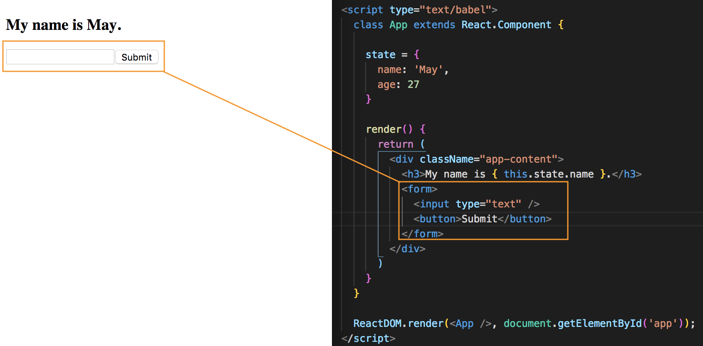
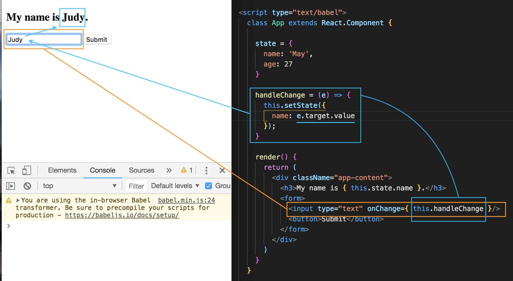
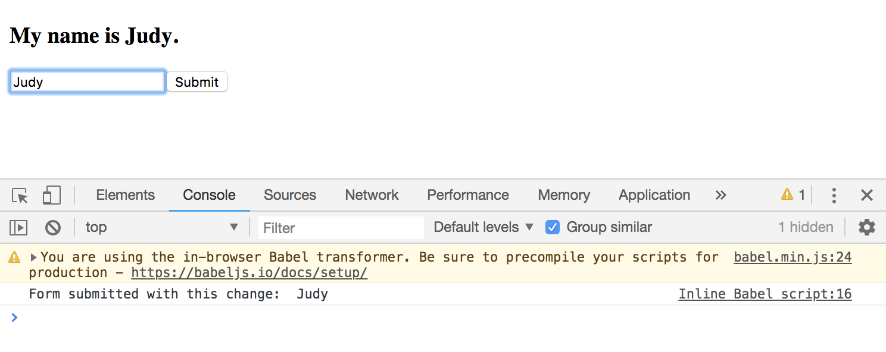

# React and Forms

A big part of most websites is to use input in a form, like maybe a contact form, form to update profile page or writing on a message board. So, we need a way to work with froms and the data a User inputs within React.

This will be a basic intro to how to work with forms in React.

## Create a Form

Let's create a simple input form where the User can type in their name that's going to update the ```state``` immediately and it'll update and when they click submit, it'll log their name to the console.

<kbd></kbd>

## ```onChange={  }``` Event Method - Input Field

How do we detect when the user is typing inside input field? And then also change the ```state```, the name data, based on what the User types.

We use an **event** ```onChange``` and it'll fire everytime there's a change of value inside the input field. Inside the ```{ }``` we're gonna have it equal to the function we want to fire everytime there is a change.

```
<input type="text" onChange={  }/>
```

Next, defined the function outside of the ```render()``` function and let's call it ```handleChange``` and inside the function ```this.setState()``` is used to change the ```state```.

Inside ```this.setState({ })``` we want to change the ```name``` property of the ```state```. But, how do we get the value of what the User is typing into the input field? That's what we want to change to.

Well, we know we have access to the event object with ```e``` passed in the custom function parameter and we can grab the ```target``` element, which is the input field and on this ```target``` we have a property called ```value``` and that is going to get the value of whatever is inside this ```<input type="text" onChange={ this.handleChange }/>``` input field when this function fires based on the User's action.

So, when the User types into the input field, it'll fired the ```handleChange``` function and ```setState``` and change it to the value of whatever is currently inside this ```<<input type="text" onChange={ this.handleChange }/>``` input field.

<kbd></kbd>

As you're typing in the input field, it's also updating the browser UI concurrently.

This example is how we keep track of what the User is typing into an input field. Next will be on 'submit'.

## ```onSubmit={  }``` Event Method - Submit Button

We want to take the ```value``` of the ```state```, the name in the state and log it to the console. Go back to the ```<form>``` opening tag and add ```onSubmit={ }``` event handler. We're not using ```onClick={ }``` because it only works with click and not when a person hits Enter. By using ```onSubmit``` instead, we're capturing the Enter if a user clicks on submit or whenever a user clicks on a button insde the form as well. It captures both.

We need to define a function, which is going to be called when the user submits the form. Call is ```handleSubmit``` and takes in the event object with ```e``` and inside, make sure to ```e.preventDefault()``` action of a form being submitted. Remember, when submitting a form, the default action is for the page to refresh, so we want to prevent that default behavior.

```
handleSubmit = (e) => {


  e.preventDefault();
}
```

In template add ```this.handleSubmit``` inside that ```onSubmit={ }```.

```
<form onSubmit={ this.handleSubmit }>
```

The next thing is to log out the ```name``` to the console.

```
handleSubmit = (e) => {
  console.log('Form submitted with this change: ', this.state.name);

  e.preventDefault();
}
```

<kbd></kbd>