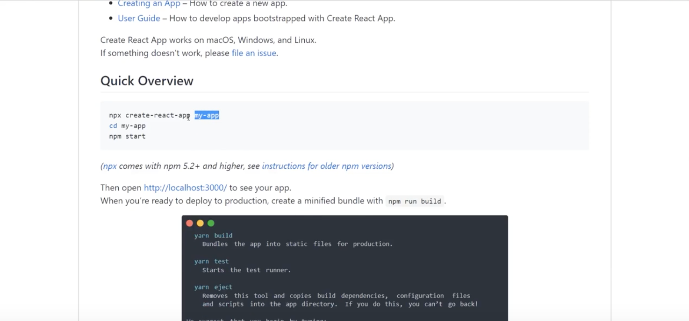
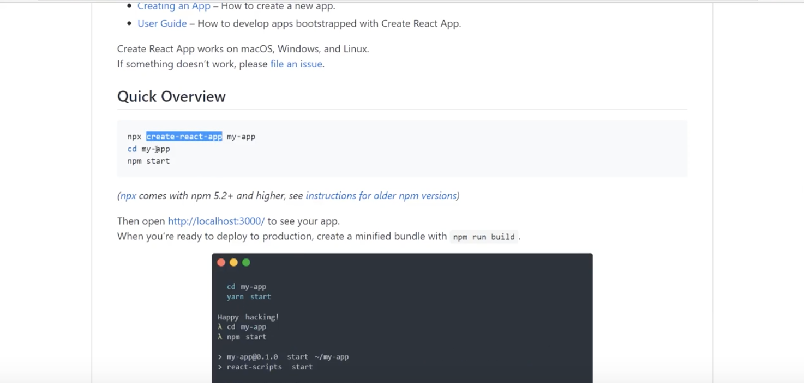
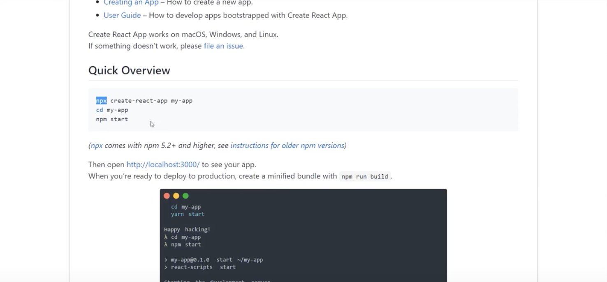

# Create React App

A command line tool to create a full React applications. We'd use it bc typically a website is made up of several different components and different pages. When the app gets more complex, use create react app is more robust setup that can handle, it can do things like:

* Development Server
* Use ES6 features which are not normally supported in browsers out of the box
* We'll also be able to keep our code modular and easy to maintain
* Give us access to build tools to create optimized lean code for deployment

Using create react app setup is very easy as well. You just need to run one command with create-react-app package and it'll take care of all the configuration of Webpack and Babel in the background. Also, it'll give us the basic React starter-project, so it gets us up and running and we can easily use the features.

https://github.com/facebook/create-react-app

It was created and maintained by Facebook.

**This is where you name your project**

<kbd></kbd>

**This is where you call create-react-app**
It's going to create the application

<kbd></kbd>

**Use ```npx``` to run the package**
We can only use ```npx``` if we have Nodejs 5.2+ and higher installed. If you're not sure what you have installed just go to https://nodejs.org/en/ and install the current version.

<kbd></kbd>

And then use this command to create project: ```npx create-react-app my-app```

* ```cd my-app``` to get into your project folder/directory
* ```npm start``` to turn on local development server to preview our app

## When Installation is Done

You're gonna notice that a folder **myapp** is created. When you expand **myapp** you'll see different folders.

* **node_modules folder** - is a folder of all the different dependencies that our React application needs, a bunch of third-party dependencies.
* **public folder** - these will serve to the Browser, the ```index.html```
* **package.json file** - that keeps track of all the different packages we have installed and this application depends on.
* **package-lock.json file** - locks down the version of the package we're using
* **src folder** - this holds the meat and potatoes, we'll mainly work here.