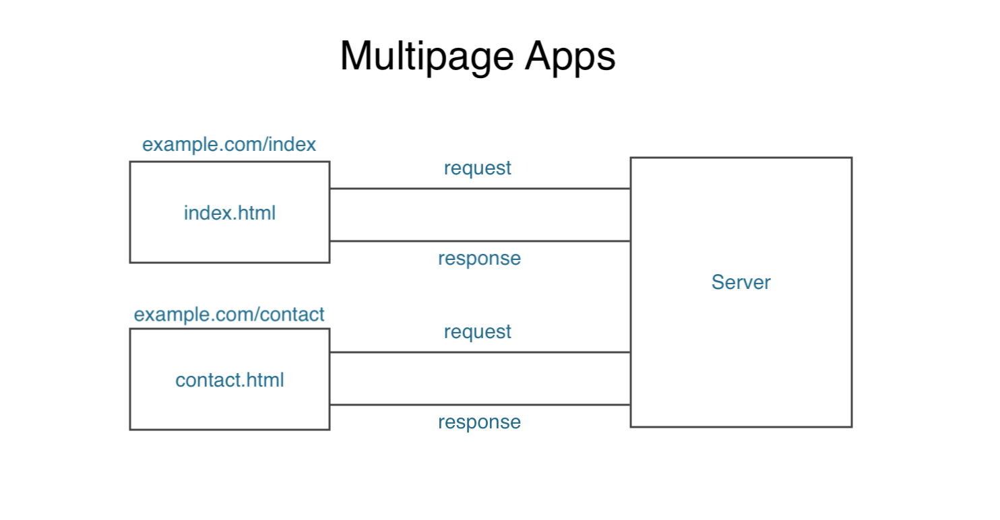
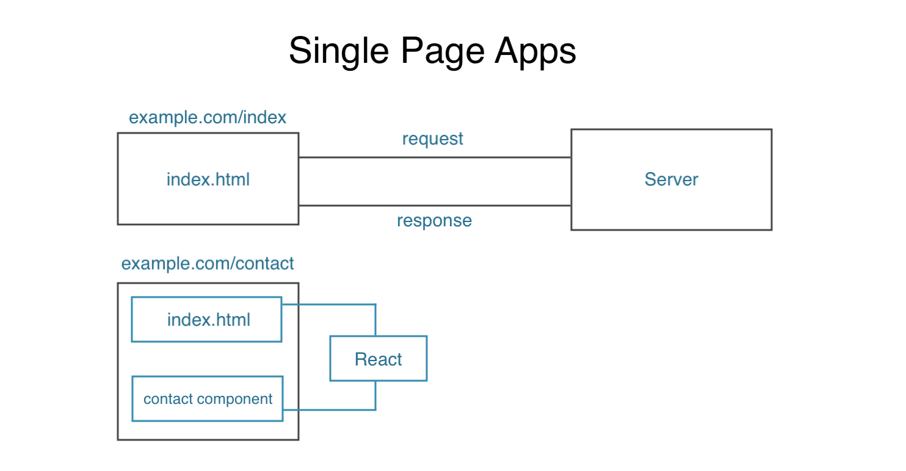

# Single Page Apps and File Structure

Typically, a lot of React Apps are **single page apps** as well. However, that doesn't mean that our user on our site only ever see's one page with the same content - it means that there will only be one HTML page that is served to the browser from the server, and then we dynamically update the content on that page, dependent on the user's interaction with the website and what URL that they visit.

* React apps are typically single page apps
* They're only on one HTML page served to the browser and updated dynamically based on the user's interaction with the website or app
* React then controls what the user sees on the page

## Multipage Website or App

In a multipage website, a user will typically go to an address like the example.com/index, and that is going to send a request to the server. Then, the server is going to look at this request and look at the URL and send back an HTML page dependent on that URL, in this case, the ```index.html``` page.

When the user clicks on a link to go to another page, or inputs a specific page on the URL bar to find another page, what's going to happen is that we're going to make another request to the server, the server is going to look at it and it's going to send back a different HTML page that matches that address that was requested. So, this is a typical mutlipage application, this is not how React works.

<kbd></kbd>

## Single Page Apps

With React, it's a bit different, but first of all, when we make a request, we might go to the ```example.com/index``` to get that initial request, the initial page.

So, the request goes to the server and then it send back the ```index.html``` file. But, when it reaches the browser, React takes over the application. Then onwards, if we click on a link to go to a new page, for instance, ```example.com/contact```, then React is goin to intercept that request and it's not going to go to the server, but React will handle it and it'll dynamically update the browser with the ```/contact``` component. React will load in that component and it stops the request from going to the server, so this saves us that trip to and back from the server, making our application faster. 

This is the heart of React. It'll show different components to the user, depending on their actions all on the front-end.

<kbd></kbd>

## First Project with Create React App

The ```src``` folder is the important folder in which we'll be doing most of our work in.

But, in the ```public``` folder, that's where our ```index.html``` file will be located and served up by the server when we go to our website. This is the initial index.html file. 

What React is going to do is inject our components dynamically into this ```<div>```: 

**index.html**
```
<div id="root"></div>
```

**So, where do we create these components to get them injected into this ```<div>```?**

* Create them inside the ```src``` folder

## App.js

```App.js``` is a dummy component that React has already created for us when we generated this project from the ```create-react-app``` command. You can see that it's a Class-based component.

```
import React, { Component } from 'react';
import logo from './logo.svg';
import './App.css';

class App extends Component {
  render() {
    return (
      <div className="App">
        <header className="App-header">
          
          <h1 className="App-title">Welcome to React</h1>
        </header>
        <p className="App-intro">
          To get started, edit <code>src/App.js</code> and save to reload.
        </p>
      </div>
    );
  }
}

export default App;
```

It has the ```render()``` method and inside is a JSX template. So, there's nothing new from what we learned earlier so far. Then at the end of the file, we're exporting this App class ```class App extends Component``` with ```export default App;``` so we can then render it at some point to the DOM.

**Where do we render this Component to the DOM?**