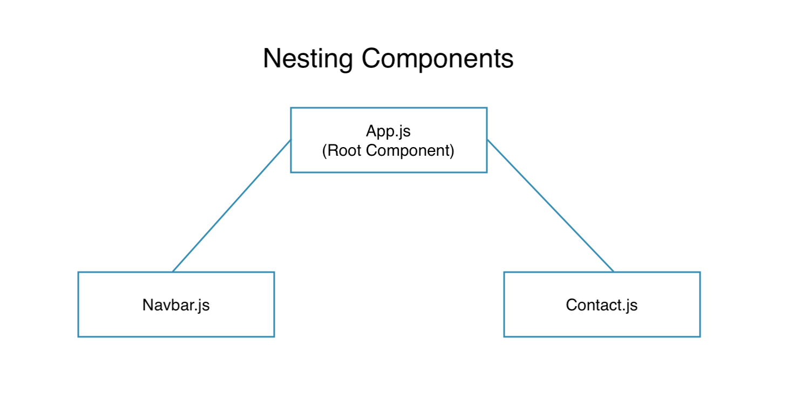
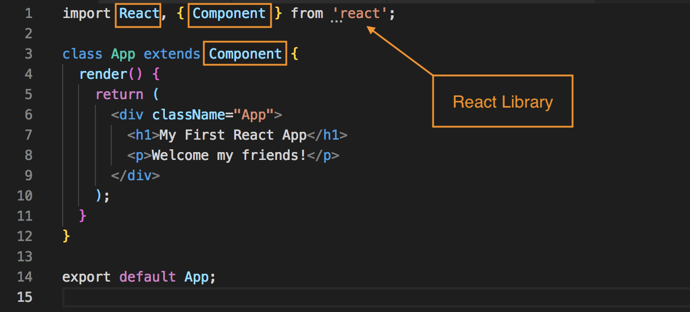

# React - Nesting Components

Now, we have our first React app up and running, but it's only showing one component, the only component being rendered to the DOM, that's the App.js file component.

This is known as the **Root Component** in React. The Root Component is the mother of all components that sits at the top of our application structure.

Typically, React Component has one **Root Component** which is always rendered to the DOM and in this example, it is ```App.js```, it sits at the top of the tree.

<kbd></kbd>

Everytime someone visit our application, this root component - App.js, is rendered. Then, if we want to show different components, we can nest them inside that root component. We can switch these components in and out depending on the user's behavior on the website.

When a component sits inside another component, we call it **Nesting Components**. For example, in this image, the Navbar Component is nested inside the App Component.

Let's look at the code for nesting components:

**App.js**
```
import React, { Component } from 'react';

class App extends Component {
  render() {
    return (
      <div className="App">
        <h1>My First React App</h1>
        <p>Welcome my friends!</p>
      </div>
    );
  }
}

export default App;
```

We're going to create a new component and nest that newly created component inside this root App Component. First, we need to make a new file for that new component in the ```src``` directory called ```People.js``` and we want to our new component in this file.

First, let's review, remember when added the React script directly in the HTML file, this was the beginning example, we did:

```
class App extends React.Component {}
```

But, we don't need to do that anymore bc at the top like in the ```App.js``` premade example, we already have imported React and also ```{ Component }``` from the React library as well. So we can just next say, ```class App extends Component``` because of that import

```
import React, { Component } from 'react';

class App extends Component
```

<kbd></kbd>

* Use ```import React, { Component } from 'react';``` whenever we create a **Class-based Component**, we need to import these two thing: React and Component
* Next, create that Class-based Component with the name People: ```class People extends Component {}```
* Inside, we need the ```render()``` method
* And the ```render()``` method returns a JSX template
* For the JSX template, you need a ```<div>``` first with ```className="person"``` (emmet's shortcut is ```div.person``` and hit tab)
* Inside the root ```<div>``` create another series of ```divs``` one for name, age and occupation.
* Finally, we need to ```export``` it bc we want to later import it into ```App``` Component and then nest it with ```export default People;```

**People.js**
```
import React, { Component } from 'react';

class People extends Component {
  render() {
    return(
      <div className="person">
        <div>Name: Rider</div>
        <div>Age: 27</div>
        <div>Occupation: Student</div>
      </div>
    )
  }
}

export default People;
```
