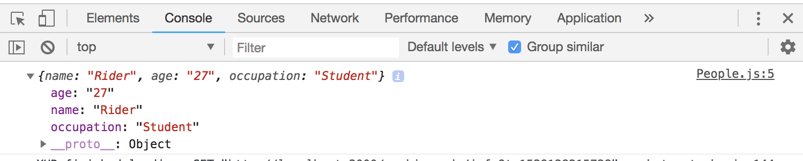
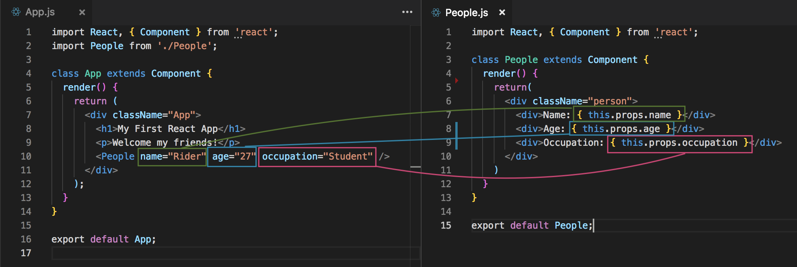
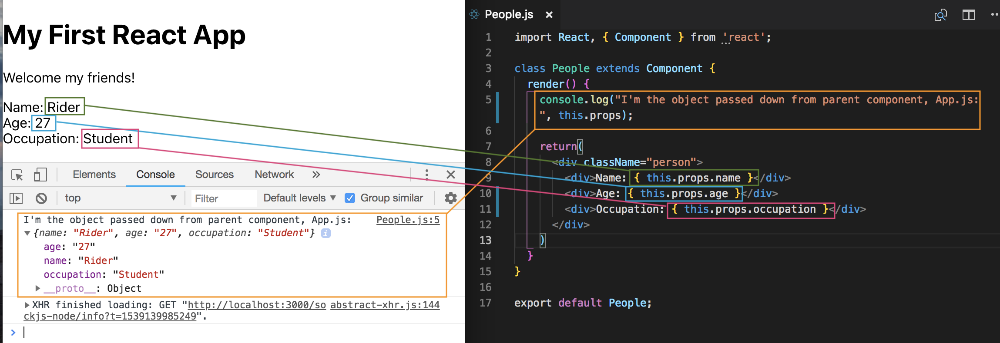

# Props

Now, we're at the stage where we have two components: App.js is the **Root** or also called **Parent** Component, and the People.js is the **Child** component bc it's sitting inside the parent component.

We've already seen ```state``` to store local data for a component, but now we'll learn about ```props``` and props are a way for us to pass data from one component like the parent component to a child component. So, we can pass data from App.js to People.js component, we can do it instead of hard-coding like what we did earlier with info data on name, age and occupation in People component.

Imagine we want to pass the ```person``` data ```<div>Name: Rider</div><div>Age: 27</div><div>Occupation: Student</div>``` from the parent component of App.js to the child component of People.js, then render that data, we can do that by using props.

* **```props```** - is just short for properties

## Create ```props``` with ```values``` to Pass Down from Parent to Child Component

We pass those ```props``` on the ```<People />``` component nested inside App.js where output into the JSX template. So all we do is make up property names and give those values to pass them down into the App.js component. For example, we can pass down a ```name``` prop with a string ```name="Rider"```. You can add more properties like ```age="27" occupation="Student"```. What we're doing here is just making up three property names and giving them values. Now, those values are being passed into this ```<People />``` component.

**App.js**
```
import React, { Component } from 'react';
import People from './People';

class App extends Component {
  render() {
    return (
      <div className="App">
        <h1>My First React App</h1>
        <p>Welcome my friends!</p>
        <People name="Rider" age="27" occupation="Student" />
      </div>
    );
  }
}

export default App;
```

## How to Access Class-based Components Use in Child Component

We access those in Class-based components automatically from ```this.props```. ```this``` references in the component and ```.props``` is to access the props object on this component.

Let's test it out by logging inside the ```render()``` method bc after all, it's just a JavaScript function and we can add JavaScript in here.

* **```this.props```** - inside the render method, when console.log, is going to give us an object all of the different ```props`` that we've passed down from App.js component or whatever parent component

**People.js**
```
import React, { Component } from 'react';

class People extends Component {
  render() {
    console.log(this.props);

    return(
      <div className="person">
        <div>Name: Rider</div>
        <div>Age: 27</div>
        <div>Occupation: Student</div>
      </div>
    )
  }
}

export default People;
```

You'll see logged into the console is this object with the three ```props``` we passed down from the parent component, App.js.

<kbd></kbd>

## Output ```props``` from Parent Componet to Child Component JSX Template

Now, let's output those ```props``` into our People.js JSX tempate.

* Use curly braces ```{ }``` to output dynamic content,
* then inside the curly braces, ```this.props``` and ```.whatevername```
* like ```this.props.name``` from the prop name we wrote in App.js

<kbd></kbd>

**People.js**
```
import React, { Component } from 'react';

class People extends Component {
  render() {
    return(
      <div className="person">
        <div>Name: { this.props.name }</div>
        <div>Age: { this.props.age }</div>
        <div>Occupation: { this.props.occupation }</div>
      </div>
    )
  }
}

export default People;
```

<kbd></kbd>