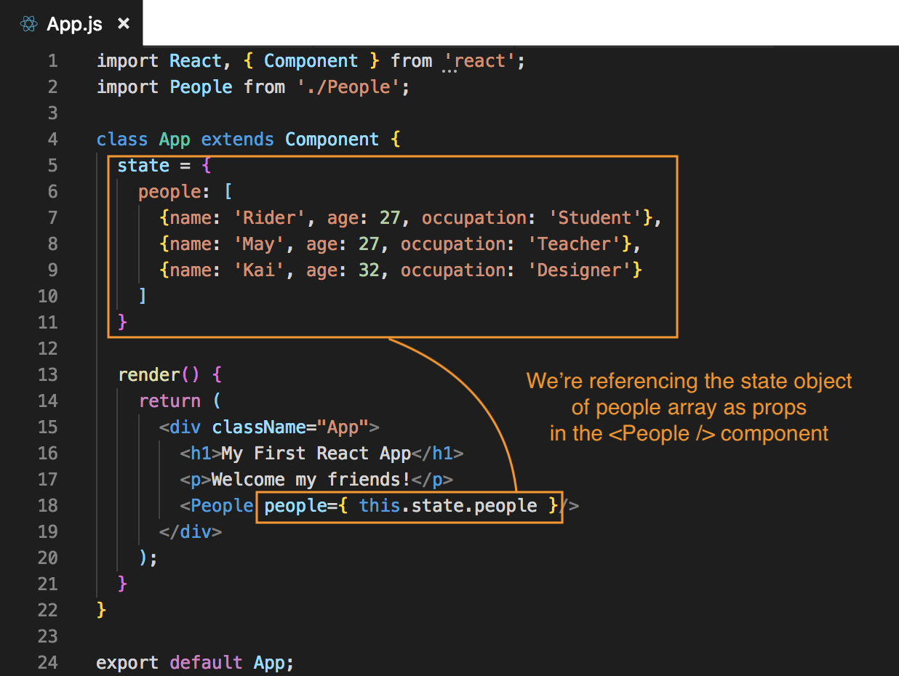

# Outputting Lists of Props

Let's try passing a list into this component and then inside that component, we recieve that list of props, cycle through them and output each prop in the People.js component.

Since we're passing a list of props into the component, we don't need to output them twice like:


**App.js**
```
...
class App extends Component {
  render() {
    return (
      <div className="App">
        <h1>My First React App</h1>
        <p>Welcome my friends!</p>
        <People name="Rider" age="27" occupation="Student" />
        <br />
        <People name="May" age="27" occupation="Teacher" />
      </div>
    );
  }
}
```

Because they're all going to be going into the same single component.

Also, instead of defining that list as ```props``` on the ```<People />``` component directly, we will define that data in the ```state``` above the ```render()``` method. Create a ```state``` object and then we'll pass that property of the state down into the ```<People />``` component.

First, create a property called ```people``` in the ```state``` object and it's going to be an ```[ ]``` array. Inside that array will have a list of objects with each person's info. Remember to include an ```id``` property for each person.

**App.js**
```
...
class App extends Component {
  state = {
    people: [
      {name: 'Rider', age: 27, occupation: 'Student', id: 1},
      {name: 'May', age: 27, occupation: 'Teacher', id: 2},
      {name: 'Kai', age: 32, occupation: 'Designer', id: 3}
    ]
  }

  render() {
    return (
      <div className="App">
        <h1>My First React App</h1>
        <p>Welcome my friends!</p>
        <People />
      </div>
    );
  }
}
```

## Pass Array into as Props

So, each array item is an object, we're gonna pass this array of objects down into the ```<People />``` component inside the ```render()``` method. We will recieve that array on People.js as a prop and we will cycle through it and output some HTML for each individual person.

First, in App.js, let's pass the array through to ```<People />``` component as ```prop```. We can call our newly created prop ```people``` and set it equal to ```this.state.people```. All we're doing is referencing the array of objects in the ```state``` earlier.

<kbd></kbd>

## Have Access to People Array in Another Component

Inside People.js, we will have access to people array via creating a variable and grabbing that data.

**People.js**
```
const people = this.props.people;
```

is the same as the destructured version:

```
const { people } = this.props;
```

So, we grab the ```people``` property with ```const { people }``` off the ```this.props``` object, so we have that array of ```people``` from App.js stored in here now.

Next, we want to output it to the DOM.

## Output DATA into the DOM

