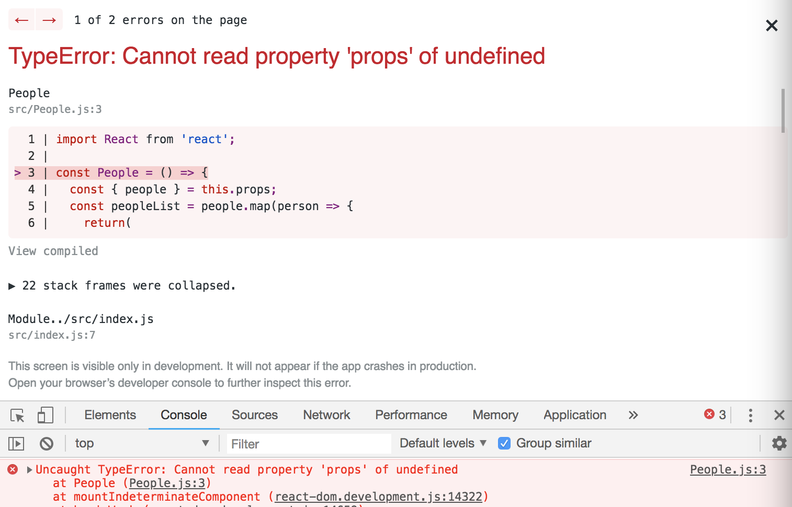

# Stateless Components

There are different types of Components we can have in a React Application, Container vs. UI Components

## Container Component

It's not concern of the UI or the look of the application. They normally contain ```state``` of the data and they serve as data sources, so they can have **lifecycle hooks** where they can go out and grab data, and store that in their ```state``` and nest other components within them. We use **Classes** to create Container Components aka **Class-based Components**.

* Contain ```state```
* Contain **lifecycle hooks**
* Not concerned with UI
* Use **Classes** to create

## UI Components

These don't contain ```state``` and they recieve all of their data from ```props``` and those data can come from **Container Components** bc they do have ```state```, go out and grab data, and store in their ```state``` and then they can pass that data down into the **UI Components** as ```props``` and that's how UI Components recieve data. They generally don't have ```state``` of their own. They're primarily concerned with the UI and how that data is presented on the screen. We don't use Classes to create these Components, rather, we use Functions to create them. They're also sometimes called **Stateless Components** or **Functional Components**.

* Don't contain ```state```
* Recieve data from ```props```
* Only concerned with UI
* Use **Functions** to create

## Container vs UI Components

<kbd></kbd>

**App.js** is the Root Component and it contains these three other components like Navbar.js, People.js and Contact.js. It may go out to a database via a ```lifecycle hook```, grab some data, store that on its ```state``` inside this component and then pass that data down as a ```prop``` to the UI/Functional Components like Navbar.js and People.js.

**Navabar.js** and **People.js** are create by Functions and not Classes and that's bc they don't need their own ```state```. They don't necessarily need ```data``` or ```state```. They're more concerned with UI. Like how do we output link on the page. If they do use data, they get them from the Container Component, which is passed down to them as ```props```.

**Contact.js** could be a Container Component. We can nest Containers inside Containers. Generally, a contact form would have its own local state to store the user's input into that form. So, we would build this with a Class, instead of a Function. It could also have other Components nested inside that as well.

## Change from Class-based Container Component to Functional UI Component

In this example, we're gonna turn the previous example on the People.js component from a Class Component to a UI Component by using a Function to create instead of a Class.

**People.js - Class-based Container Component**
```
import React, { Component } from 'react';

class People extends Component {
  render() {
    
    const { people } = this.props;
    const peopleList = people.map(person => {
      return(
        <div className="person" key={person.id}>
          <div>Name: { person.name }</div>
          <div>Age: { person.age }</div>
          <div>Occupation: { person.occupation }</div>
        </div>
      )
    })

    return(
      <div className="people-list">
        { peopleList }
      </div>
    )
  }
}

export default People;
```

We'll need to remove ```class People extends Component``` and then create a Function with a ```const People = () =>```. Then, inside the Function, you don't need the ```render()``` method anymore, all we need to do is return some JSX on the bottom. Also, remove ```{ Component }``` at the top on ```import``` line bc we're extending that class anymore, but we're still need to import React.

```
import React from 'react';

const People = () => {
  const { people } = this.props;
  const peopleList = people.map(person => {
    return(
      <div className="person" key={person.id}>
        <div>Name: { person.name }</div>
        <div>Age: { person.age }</div>
        <div>Occupation: { person.occupation }</div>
      </div>
    )
  })

  return(
    <div className="people-list">
      { peopleList }
    </div>
  )
}

export default People;
```

But, when you run the app, you'll see that we're getting an error on ```people``` saying that it cannot read ```props```. Where do we reference ```people```? We do it at ```const peopleList = people.map``` and when we use a Functional component like this, we don't automatically get the ```props``` passed to it like we do inside a Class-based component.

<kbd></kbd>

What we have to do is take in those ```props``` as a **parameter** so now we have those and what we can do is access the ```props``` and we don't say ```this.props``` bc we're not referring to an Instance of a Class anymore. We're just referencing the props that we pass into that function as a parameter.

So change from:

```
const People = () => {
  const { people } = this.props;
```

to:

```
const People = (props) => {
  const { people } = props;
```

<kbd></kbd>

See, no it all works :) 

## Destructured Version

We destructure directly inside the brackets where we recieve the ```props``` and remove the ```const { people } = this.props;```. If you're recieving more than one props, it would be like ```const People = ({people, company, school}) => {...}```.

```
import React from 'react';

const People = ({people}) => {
  const peopleList = people.map(person => {
    return(
      <div className="person" key={person.id}>
        <div>Name: { person.name }</div>
        <div>Age: { person.age }</div>
        <div>Occupation: { person.occupation }</div>
      </div>
    )
  })

  return(
    <div className="people-list">
      { peopleList }
    </div>
  )
}

export default People;
```