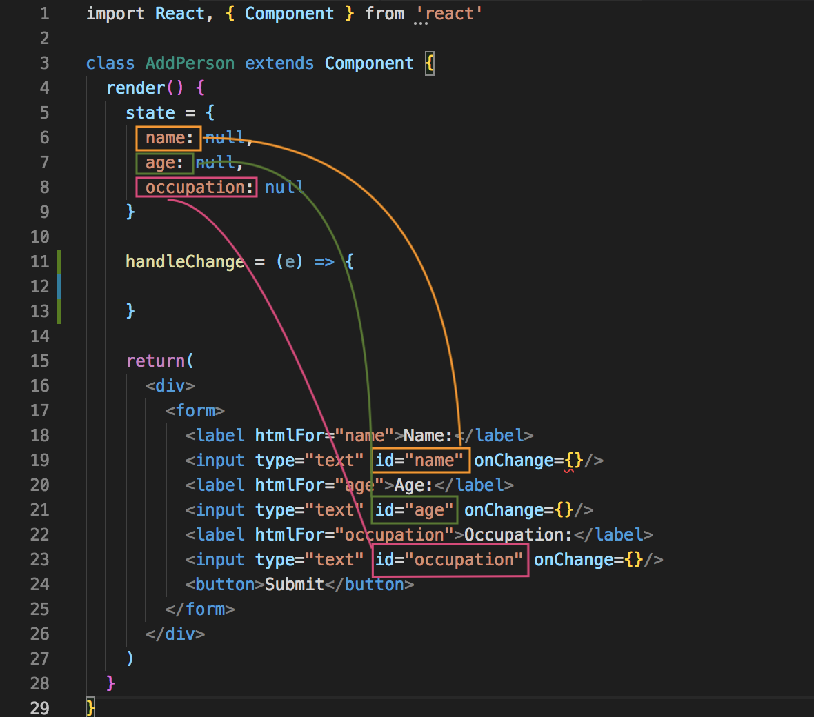

# Forms with React

This form example is going to be for adding a new person into our list. So, this form is going to need three input fields: name, age and occupation, then a button to add that new person into the list.

Ulitmately, when a user fills the form and submits by clicking on the button, it's going to updated the ```state``` in App.js. When ```state``` is updated, bc is it being passed into ```<People people={ this.state.people }/>``` component, that ```props``` is going to update inside People.js and it'll re-render the JSX template in it.

## Create the Form Component

Create a new component called AddPerson.js. 
Now, should it be a Class-based Component or a UI Component? Well, we need to store the user's input and we'll need to store it locally in the Component's state. So, bc we need that ```state```, this'll have to be a Class-based Component.

```
import React, { Component } from 'react'

class AddPerson extends Component {
  render() {
    return(
      <div>
        <form></form>
      </div>
    )
  }
}
```

Inside the ```<form>``` tag, we don't need an ```action=""``` bc we'll be handling the ```submit``` event manually and we'll attach that later on.

```
<label htmlFor="name"></label>
```

For ```label``` inside the ```<form>```, the ```htemlFor="name"``` is going to look for the input field with the ```id``` of ```name``` and associate that label with that input field. 

```
<input type="text" id="name" onChange={}/>
```

Add the ```id="name"``` and the ```onChange={}``` event and we'll put the function into it later on.

```
import React, { Component } from 'react'

class AddPerson extends Component {
  render() {
    return(
      <div>
        <form>
          <label htmlFor="name">Name:</label>
          <input type="text" id="name" onChange={}/>
          <label htmlFor="age">Age:</label>
          <input type="text" id="age" onChange={}/>
          <label htmlFor="occupation">Occupation:</label>
          <input type="text" id="occupation" onChange={}/>
          <button>Submit</button>
        </form>
      </div>
    )
  }
}
```

## Create Function to Handle Change

This function will update the ```state``` to store what the user types into the form's input fields.

First, we need to create the ```state``` in this component.

```
state = {
  name: null,
  age: null,
  occupation: null
}
```

### Know Which Field to Update

Do we need a separate function to handle each input? Actually, we can just have one function to handle it for us.

Let's create a function called ```handleChange```. We want to handle the ```state``` where the user has typed by using ```this.setState()``` and then inside, we'll have to say what we want to set the state of. 

But, how do we know what property we want to update for each input field, if only one function is going to fire for all input fields? Well, remember we added an ```id``` for each of the input fields. When the function fires, what we can do is grab the ```id``` of the target element from the event object, grab that, and then we can query that ```id``` up in the ```state```. That ```id``` is the same name as the property in ```state```.

<kbd></kbd>

Looks into the event object and target the element and then the id. This is very much like square brackets notation. Imagine if we had an array and if we wanted to get the third item in the array we'd do something like ```name[2]``` bc the thrid item is index 2. Object works in similar ways like ```person['name']```. For our ```handleChange``` function, we'll use:

```
[e.target.id]
```
It'll represent the access to name, age and occupation. It's going to look for the name, age or occupation property on the the ```state```. This takes care of knowing which field to update.

### Get the Value We Want to Update With

```e``` is the event object, ```target``` is which input field and ```value``` is whatever the input value inside that input field. 

```
[e.target.value]
```

Next, we need to call the function everytime we make a change into the input fields with ```onChange={ this.handleChange }```.

### Handle onSubmit

Use the ```onSubmit={...}``` event listener to the ```<form>``` tag. Inside ```onSubmit```, we'll fire a different function. Create ```    handleSubmit = (e) => {...} ``` and remember to add the ```e.preventDefault()``` action.

