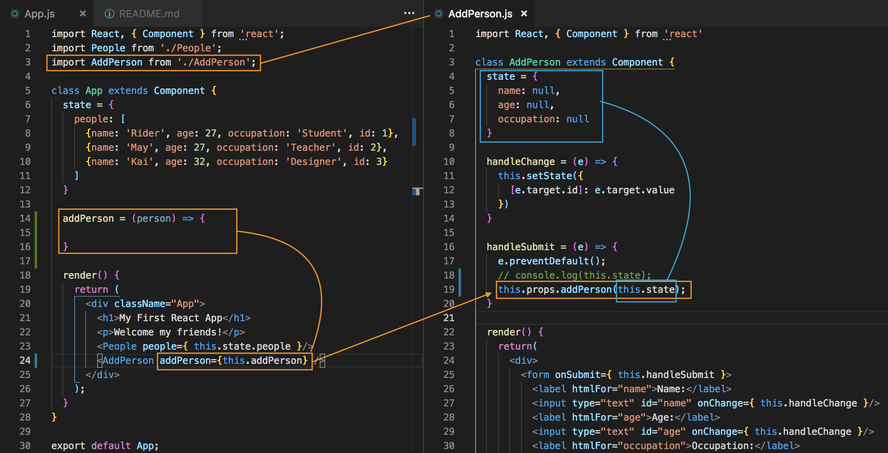
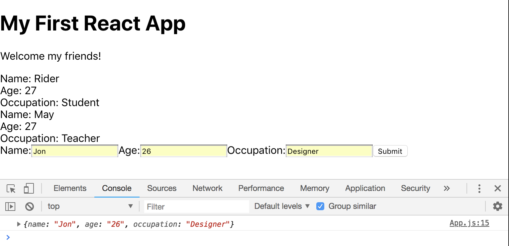
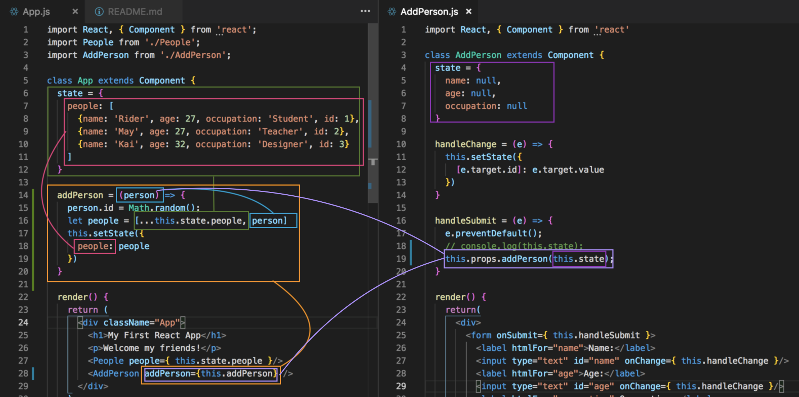
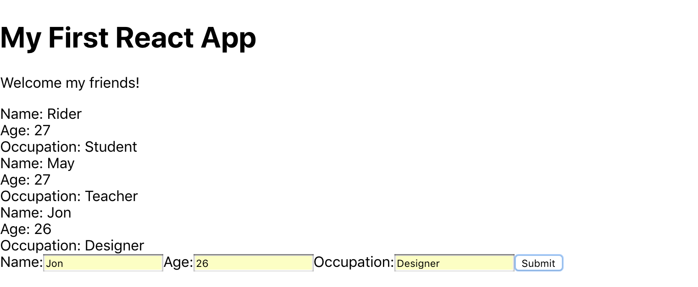

# Functions as Props

Now, we want to take the object of new person and add it to the ```state``` of the root component. We need to push it on to that array. When we push it into that array, it'll also dynanmically update in the browser, the list of people.

First, we need to create a function inside the root App.js component with ```addPerson = () => {...}``` and inside that function we want to take in a parameter, the parameter will be the new person object.

We need to pass ```addPerson``` down as props in the nested ```<AddPerson />``` component. If we do that, we'll have access to that function to be able to call the function from the AddPerson component.

So, we'll need to create a ```prop``` inside the ```<AddPerson />``` component.

Then in the AddPerson.js file, inside the handleSubmit function, use ```this.props.addPerson(this.state);```. We're calling the function ```addPerson``` and passing in the ```state``` object.

Now, in App.js we have access to those things in AddPerson.js.


<kbd></kbd>

Go back to App.js to our new addPerson function and ```console.log(person);``` bc ```person``` is what we will be receiving, which should be the ```state``` of ```this.props.addPerson(this.state);``` inside the ```handleSubmit``` function from AddPerson.js.

<kbd></kbd>

It'll still work :)

We're basically passing data from the child and back up to the parent component through functions as props. The info from the child is being passed in as a paremeter inside the function in App.js ```addPerson = (person) => { console.log(person); }```

Next, we'll need to add these new person into the ```state``` in the root component. Remember, we'll need to give a unique ```id``` for each person we or the user adds. But, in this example, we'll do something very simple.

Also, remember, we cannon alter the original state. We need to create a copy of the original ```state``` array and then add that new person to the copy of that array. We do it with the ```...``` **spread operator**.

```let people = [...this.state.people]``` the spread operator is taking ```this.state.people``` array, it's spreading out by adding the three dots in front of it into its individual objects and it's putting those object into the new array. Then ```let people = [...this.state.people, person]``` where person is the new person added.

```this.setState({ people: people })``` the people property is going to equal to the new people array.

<kbd></kbd>

The People.js Component is the one rendering the template for the list of people.

<kbd></kbd>