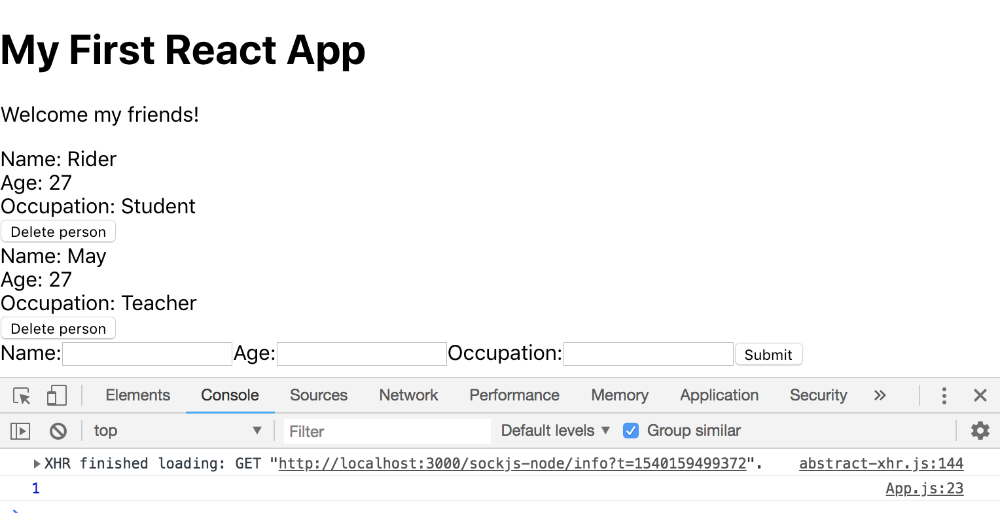

# Deleting Data

Create another function ```deletePerson = (id) =>``` it'll take in a parameter of ```id``` bc we're gonna use that try and find which person that matches that id we're looking for to delete.

Next, we need to pass it down as a prop into the ```<People people={ this.state.people }/>``` nested component. We'll call that ```prop``` as ```deletePerson``` and we'll set it to ```this.deletePerson``` in App.js. Now, we need to pass this ```prop``` into the People.js component file.

Remember, the People.js component is a functional component and we can access ```props``` directly with destructuring. We already have people, let's grab ```deletePerson```.

```
const People = ({people, deletePerson}) => {...}
```

Add a button with:

```
<button onClick={deletePerson(person.id)}>Delete person</button>
```

And we need to pass in the ```person.id``` in order to identity the unique item to that function.

Remember, we need to wrap ```deletePerson(person.id)``` in an anonymous function to prevent automatic firing. 

```
<button onClick={() => {deletePerson(person.id)}}>Delete person</button>
```

In App.js, test it:

```
deletePerson = (id) => {
  console.log(id); // test
}
```

<kbd></kbd>

## Change the Data in Array

We need to use ```filter()``` method to delete bc it's non-destructive. What it's going to do is cycle through the array and then return a new array based on this one and it'll filter certain items out of the array based on a certain condition. For us, the condition we want is to check for this ```id``` equal to the person id.

```let people = this.state.people``` to grab the current ```state```, then add ```filter()```. In the filter method, we need to pass in a **callback function** and in it we want to have access to each person that we're cycling through. We want to return a value of either true or false. If it is true, the ```person``` will remain in the new ```people``` array. If false, it's going to take that person that we're cycling through and filter out of the new array.

We need to perform a verification to check if the ```id``` that's passed in the paramet is equal to ```person``` id in the filer method. ```return person.id !== id;``` check is ```person.id``` is not equal to ```id``` that's being passed in bc we want to delete. This line will return false if it is equal; therefore, it'll filter the person out of the array.


## setState with New Array

Now that we have a new array, we can ```setState``` and change the ```people``` property and pass it the new ```people``` array.