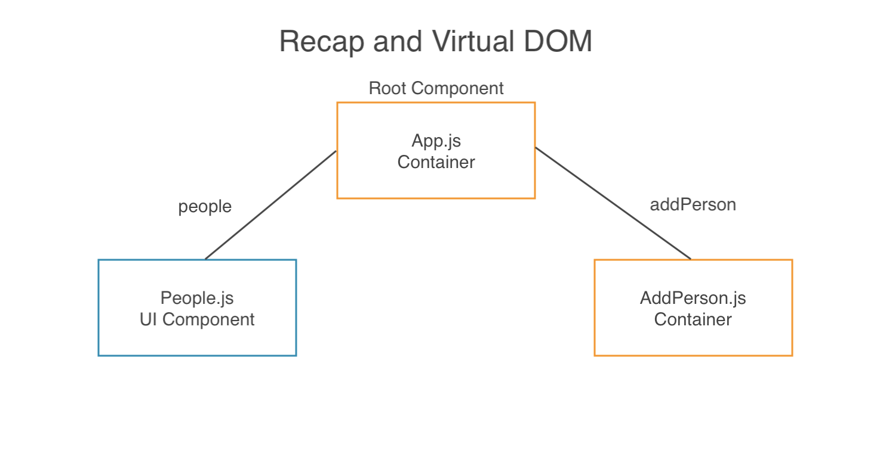
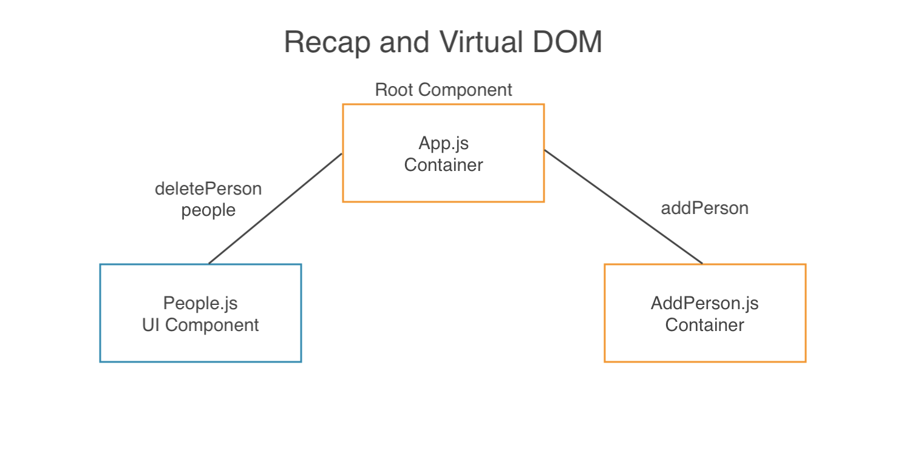
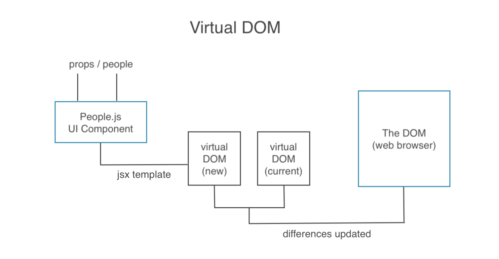

# Recap and Virtual DOM

## Recap on myapp example so far

<kbd></kbd>

Our application structure example currently looks like this with App.js the Container Component which is a Root Component at the top. In here, we define a ```state``` with a ```people``` property, which is an array of people.

That array of ```people``` is passed down as a ```prop``` into the People.js UI Component. The job of this UI Component is to cycle through these ```people```, which are passed down as a ```prop``` and output them to the DOM with some template for each individual ```person```.

Now, if we want to add a new person, we have the AddPerson.js Class-based Container Component. We enter into the form and we fire the ```addPerson``` function, which is passed down into the AddPerson.js Component as a ```prop``` from App.js. When we invoke the ```addPerson``` function it takes the new ```person``` and passes it back up to App.js and it adds that new person on the ```people``` array in App.js ```state```.

When the ```state``` changes for ```people``` in App.js, the ```people``` ```prop``` is going to update, which is passed down to the People.js UI Component. Whenever the ```prop``` updates inside the component, it's going to re-render the template.

If we're deleting data, it's the same cycle process.

<kbd></kbd>

If we're going to ```deletePerson``` from the App.js Component to the People.js UI Component, so we can invoke is from the People.js UI Component, we pass up the ```person.id``` of the person with want to remove.

Then, inside App.js, in the ```deletePerson``` function, we ```filter()``` through the ```people``` array on the ```state``` and remove that person who matches the id. There, we update the ```state``` in App.js, also the ```people``` prop and then updating the People.js UI component template.

So, this whole cycle is going on the whole time based on the the User's interaction, whether it's deleting or adding. But, how is this all working behind the scenes?

## The Virtual DOM

<kbd></kbd>

**UI Component**

We have our People.js Component constantly updated bc we're constantly receiving different versions of the ```props``` like whether a person is being removed or added to the ```state``` of the App.js, Root Component.

**JSX template**

Everytime we get those new ```props``` we move on the jsx template portion to update the template dependent on that data, so we can output it to the web browser.


**Virtual DOM**

Each time we make an update to our JSX template, React will automatically create a Virtual DOM out of it, which is a JavaScript representation of the template.

At all times, it has a **current virtual DOM** running in the background, and that represents the actual **DOM**, the web browser, which is sitting in the browser currently.

When we create a **new virtual DOM** based on the changes in data, that new vortual DOM will be compared to the current virtual DOM, which reflects to the web browser DOM.

**Differences Update**

Where there are changes, those differences are updated in the web browser. So, only those differences need to be re-rendered to the browser. We don't have to re-render the whole application, just those changes based in the new virtual DOM and current virtual DOM coming from that component.

## Summary of the Cycle

This cycle happens everytime there is a change in data.

So, once we've done it once, the new virtual DOM becomes the current virtual DOM bc that then now reflects what's in the browser.

Then, if we update again, then we'll get another version of the new virtual DOM and it'll compare to the current and then update to the web browser again in the DOM.