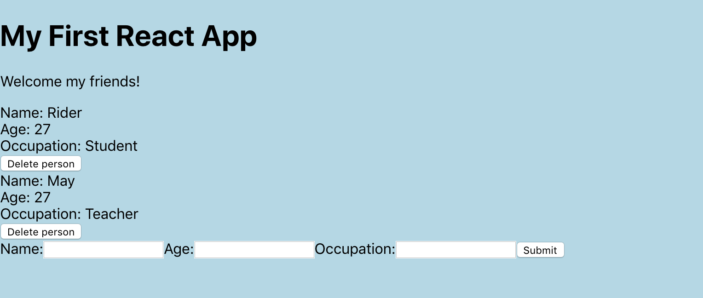
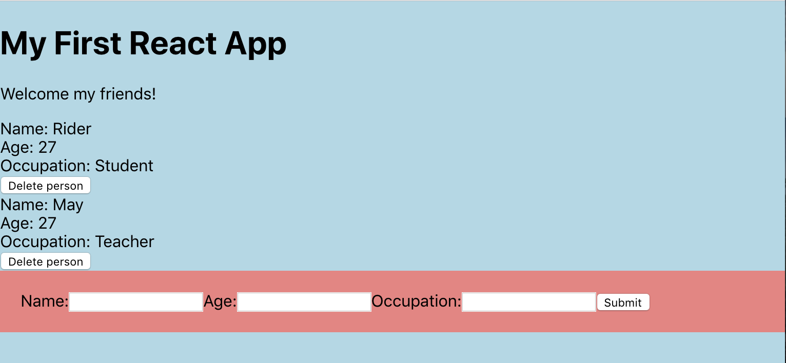
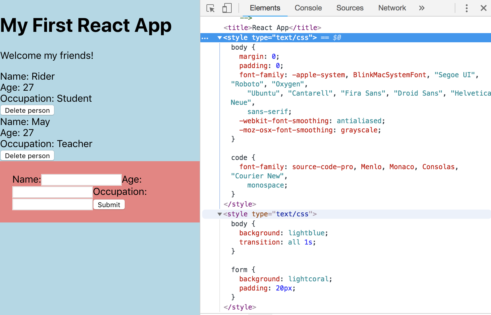

# CSS Files in React

There's a few different ways we can use CSS in React.

## Create CSS file for each indvidual component (eg. People.js and People.css)

**People.css**
```
body {
  background: lightblue;
}
```

**People.js**
```
import './People'
```

<kbd></kbd>

When doing this, the style will be applied to the other .js files as well.

Let's add more to the **People.css**:

```
form {
  background: lightcoral;
  padding: 20px;
}
```

<kbd></kbd>

It doesn't matter doesn't that we're not importing directly to the exact .js component file we're styling for. The CSS is still going to take effect on all the other component files.

But, you can get around it by specifying the ```classes``` to style. You're kinda "scoping" your style to only add style to specific parts you want stylized.

So, a good thing about using this way to style is that it automically adds vendor prefixes for us where we need them.

<kbd></kbd>

## Another way of using CSS is with **index.css**

It will be applied everywhere and we don't have to ```import``` any of the components, it's just going to auto-apply everywhere. 

## Or, we cuold use CSS Modules as well

To do that, we need to edit our configuration files. Use this guide:

https://blog.pusher.com/css-modules-react/