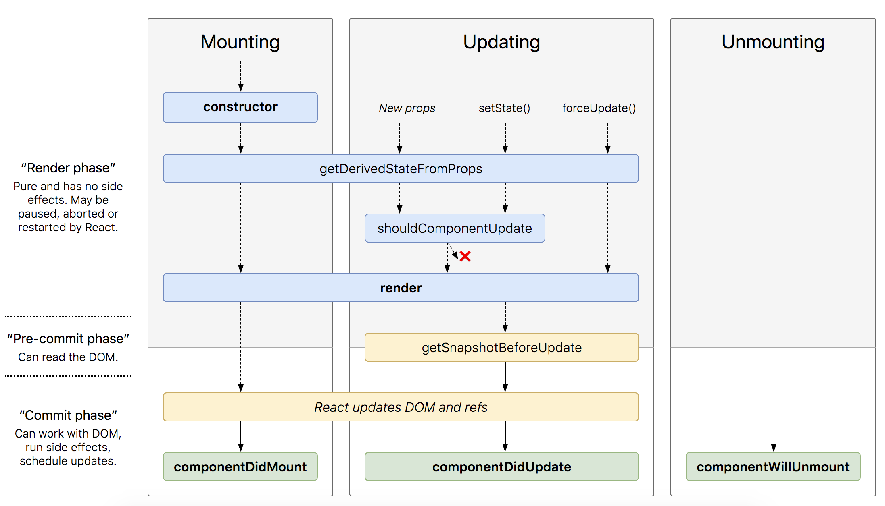
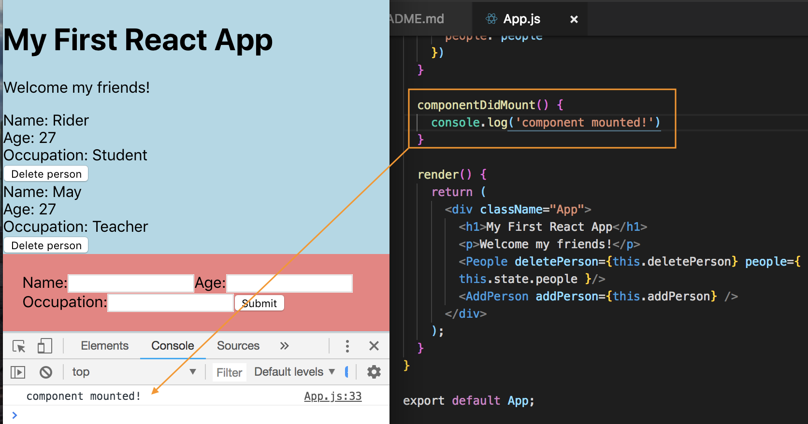
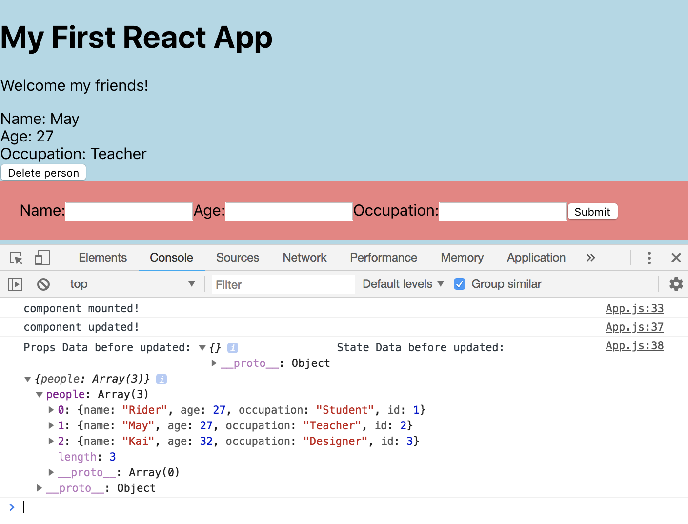
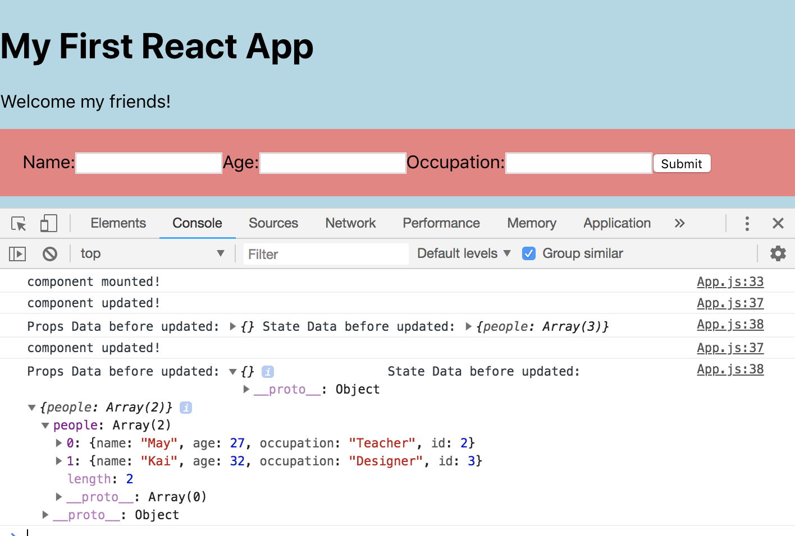

# React Lifecyle Methods

<kbd></kbd>

https://github.com/wojtekmaj/react-lifecycle-methods-diagram


It's going to go through a **Mounting** phase, an **Updating** phase and **Unmounting** phase.

## Mounting Phase

This is when a Component is first created and first mounts to the DOM.

**It'll go through a bunch of lifecyle methods**

* (1) **constructor** - is the first one, this is not necessary to call, but it offers another way to set the ```state``` of the component. Similar to how we set the ```state``` directly, we can do that inside the constructor as well.

* (2) **getDerivedStateFromProps** - this exists for one purpose only, and it enables component to update its internal ```state``` as the result of changes in our ```props```. So, it triggers on first render and then whenever we recieve updated ```props``` from a parent component is going to trigger it as well. So, we recieve those props and we recieve the current ```state``` of this component where the method is called and we can compare the ```props``` we receive to the current state if needed and then return a new ```state``` object if we want or null for no changes. It's not really often used.

* (3) **render** - this is where React takes our JSX code and prepares it to render to the DOM. It's the only one required lifecycle method in a component and it will generally return some form of JSX.

* (4) **componentDidMount** - this fires once the component first mounts. It's a good place to get any external data from a database. 

## Updating Phase

* (1) **getDerivedStateFromProps** - it first starts off with the, as stated previously, this triggers when either the ```state``` updates of ```props``` recieved change and we received the next props and the current updated states.

* (2) **shouldComponentUpdate** - this receives the next ```props``` and the next ```state``` and we can compare the ```old props``` with the ```new props``` and the ```current state``` with the ```new state```. So, we can return false here if we want to prevent the component updating and re-rendering. With that said, you could check the ```new props``` against the ```old props``` and only return true if they were different we need an update and re-render. An alternative to this is to use **Pure Components** to React (we won't look at these pure components yet).

* (3) **render** - we then have the render method again to render the template to the DOM.

* (4) **getSnapshotBeforeUpdate** - in here, we get read access to the DOM before the change is actually committed to it. We can also get current value from the DOM if we need it, like the window position, and then return that inside the method. That return value is passed to the final update hook, to allow us to use it.

* (5) **componentDidUpdate** - this is called after the template is rendered to the actual DOM. At this point too, we get access to the DOM and it's a good place to get any external data from a database if needed, but warning, if we update the ```state``` inside this hook, we could get an infinite loop and that's not something we'd want. 

Now, a lot of these lifecycles hook, we're not going to be using, just a couple in our example.

## Trying them out in the Root Component

<kbd></kbd>

It's going to ever be mounted once unless we refresh the page or delete the re-render at some point.

<kbd></kbd>

If we make changes then, it'll fire the console.log. For example, I deleted rider and you'll see in the console, it shows the previous data, but on the UI it only has May. It's only showing May bc it meets the condition that we created earlier of outputting people only if they're under the age of 30.

If we delete again, we can see that it only has 2 objects in the console, bc it was updating from previous state.

<kbd></kbd>

We can add another person too. Everytime we do this, it's going to keep comparing the ```state```.