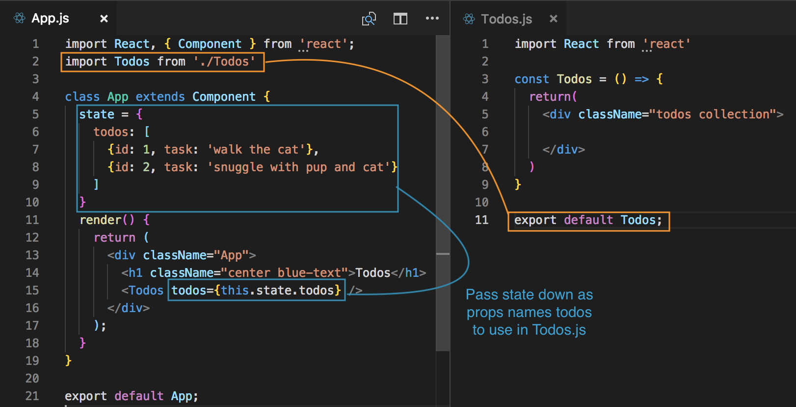
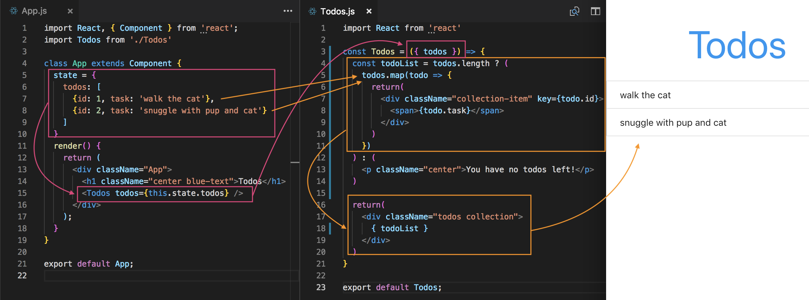
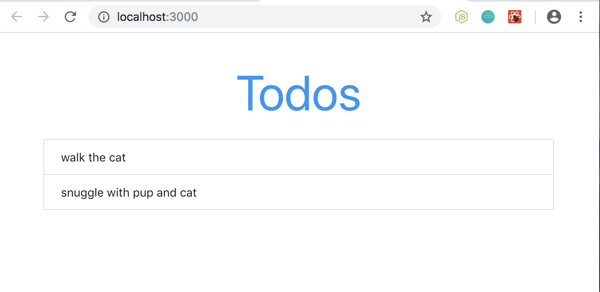
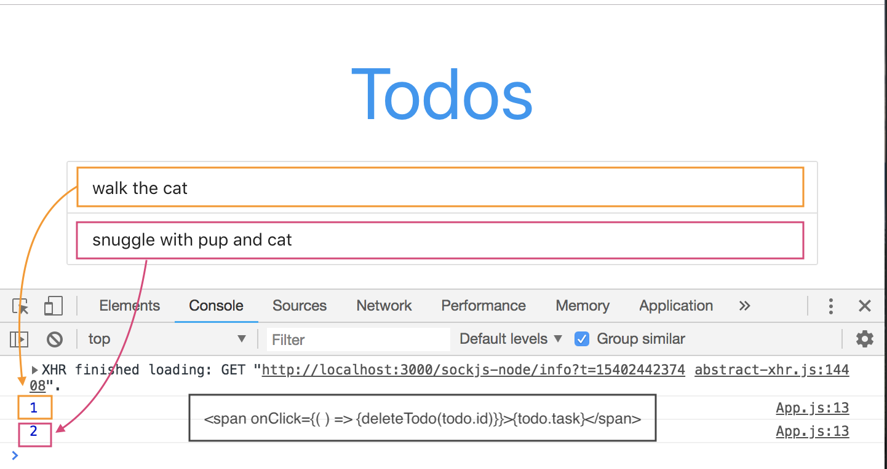
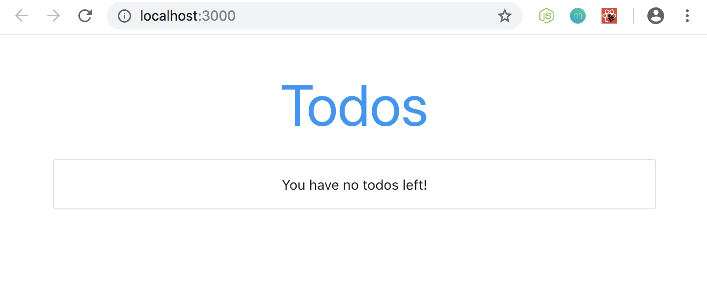

# Todo App with React

Let's bundle together everything that we've learned so far into a simple Todo App with React.

## Create a new React App

We'll set this up using ```create-react-app```, name it as ```todoapp``` and then create a couple of components to list some Todos. Then afterwards, we'll hook up all the ```events``` so that we can add and delete Todos.

## Add Materialize CSS library to style

For styling this project, we're going to use **Materialize CSS**, which is a CSS library, we'll use its Classes to stylize our project. We're not gonna make anything too stylish, so just use the CDN link on the Get Started page. We'll add the link inside our ```index.html``` which is in the ```public``` directory. Add it above the ```<title>``` tag in the ```<head>``` tag.

Link: https://materializecss.com/getting-started.html

## Get Rid of Some Files in the ```src``` Directory

* Remove: App.test.js, App.css and logo.svg
* Remember to go into App.js, the Root Component, and remove references to those files
* Also delete the elements inside the ```<div>``` tag. Only leave the ```<div>``` tags bc React requires it as root

**App.js**
```
import React, { Component } from 'react';

class App extends Component {
  render() {
    return (
      <div className="App">

      </div>
    );
  }
}

export default App;
```
## Set ```state``` inside this Root Component

App,js is our Root Component and it is also a Container Component bc it's going to be where we store the ```state``` of our application. We're going to store the Todos inside the ```state``` of this Component.

```
state = {
  todos: [
    {id: 1, task: 'walk the cat'},
    {id: 2, task: 'snuggle with pup and cat'}
  ]
}
```

## Create JSX Template to Display Output of Todos Items

We should create a separate component that is responsible for listing individual Todos. First, go into the ```src``` directory and create a new file calles Todos.js. It's going to be Functional/UI Component. We don't need to store ```state``` here bc it's already registered in App.js. Rather, we'll pass it down from App.js to Todos.js as ```props```.

**Todos.js**
```
import React from 'react'

const Todos = () => {
  return(
    <div className="todos collection">
      
    </div>
  )
}
```

* Need to ```return``` JSX template
* Give className of todos
* className collection is in reference to Materialize's class

So, we need to pass ```todos``` from the App.js Component in Todo.js and we'll do that with ```props```. We need to ```import Todos from './Todos'``` Todos.js into App.js. Now, we can nest the ```props``` inside ```<Todo />``` in the ```render()``` method.

<kbd></kbd>

Inside Todos.js, we can now access the ```state``` from App.js through ```props``` that was injected when we nested ```<Todos />``` with a prop name into the ```render()``` method in App.js. 

To do that, we'll need to have props as the parameter in ```const Todos```. We'll it the desctructured way and we're grabbing the ```todos``` of that props object. So, now we can use it below in the ```return()``` method.

Because we're getting a list, we need to ```map()``` through that list and then return some JSX for each individual item in that list and then output that list. We'll do that logic above the ```return``` statement.

```const todoList = todos.length``` what we're doing here is to check the length. If we don't have a length or todos, then we don't want to show it or we want to show a different message or set of content. If we do have todos, then want to show the actual todo list. We'll use the **ternerary operator** to check whether it is true or false. False if it is ```0```, true if we have some todos ```const todoList = todos.length ? () : ()```

We'll need to return a JSX template for each. We need a ```<div>``` with Materializes' classname ```collection-item``` to help us style our lists. Inside out div, we want to output our todos in a ```<span>``` tag and use the ```{...}``` to dynamically insert ```todo.task``` inside the cruly braces. We also need to output the ```todo.id``` as key for React. Remember, React expects a unique key on every surrounding element that we return inside this ```map()``` function when we output them to the browser, so that it can identify each individual item.

Then, you'll output it in the ```return()```

**Todos.js**
```
const Todos = ({ todos }) => {
  const todoList = todos.length ? (
    todos.map(todo => {
      return(
        <div className="collection-item" key={todo.id}>
          <span>{todo.task}</span>
        </div>
      )
    })
  ) : (
    <p className="center">You have no todos left!</p>
  )

  return(
    <div className="todos collection">
      { todoList }
    </div>
  )
}
```

<kbd></kbd>

Improve styling of list by adding ```container``` class.

**App.js**
```
render() {
  return (
    <div className="todo-app container">
      <h1 className="center blue-text">Todos</h1>
      <Todos todos={this.state.todos} />
    </div>
  );
}
```

<kbd></kbd>

## ```onClick``` Event to Delete Todos

Now, we'll need a simple event to delete these todos. When we click on one of the todos, it'll delete from the list. We'll need to go on to App.js to create a function to delete bc it has to interact with the ```state``` of ```todos[...]```. 

Create the function ```deleteTodo``` above the ```render()``` method. Pass in ```id``` as the parameter bc this function will have to find that ```id``` that was selected and ```filter()``` something from this array. To test, let's console.log the id.

We want to pass down ```deleteTodo``` function down to the ```<Todos todos={this.state.todos} />``` component as ```props``` so that we can call it from the Todos.js component when we click on an individual todo. So, we'll pass it down as the function by first giving it a prop name and assigning to the function inside curly braces ```deleteTodo={this.deleteTodo}```.

**App.js**
```
class App extends Component {
  state = {
    todos: [
      {id: 1, task: 'walk the cat'},
      {id: 2, task: 'snuggle with pup and cat'}
    ]
  }

  deleteTodo = (id) => {
    console.log(id);
  }

  render() {
    return (
      <div className="todo-app container">
        <h1 className="center blue-text">Todos</h1>
        <Todos todos={this.state.todos} deleteTodo={this.deleteTodo}/>
      </div>
    );
  }
}
```

Now, we have access to the ```deleteTodo``` function in Todos.js. We need to grab it from the props object first onto the ```const Todos = ({todos, deleteTodo})``` and then we can use it.

Next, we nee to attach a click event to the ```<span>``` to the individual item when it's ouptut so that when someone clicks on it, it'll delete it by firing the ```deleteTodo``` function. So, give it an ```onClick={}``` handler and pass in ```deleteTodo``` inside the curly braces, but remember to also include ```todo.id``` since the id is store on todo, which we're cycling through at that moment in time. Also! Remember to wrap this around in an anonymous function to prevent automatic invokation.

<kbd></kbd>

So, it works! When we click on the todo item, it'll log out the ```id```. But, now, we need to actually delete them from the UI and the ```state```.

## Remove Todo from ```state``` and UI

We want to ```filter``` the ```todos[...]``` array of todo tasks. Remember, the ```filter``` method is non-destructive. It returns a new array, so we can do it directly on this property. 

We'll store that new array in a new variable ```const todos``` and we'll assign/set it to ```this.state.todos.filter()```. Inside the ```filter``` method, will pass in a function which takes the individual ```todo``` as a parameter, so we can fire something on each todo. We also want to return either trur or false here. True for if we want to keep the item in the array or false if we want to remove it.

So, we'll say, ```todo.id``` is not equal to ```id``` then we're going to return true. If they're not equal, then we don't want to filter out. If they are equal, then this is going to return false and it's going to remove that item from the array.

```
deleteTodo = (id) => {
  // console.log(id); // test
  const todos = this.state.todos.filter(todo => {
    return todo.id !== id
  });
}
```

Next, we need to set the ```state```, set the ```todos``` to be equal to the ```const todos``` new todos array that we're creating. Now, since the ```key``` and the ```value```, ```todos: todos```, both have the same name, with ES6 shortening, we can just leave it as ```todos```.

```
deleteTodo = (id) => {
  const todos = this.state.todos.filter(todo => {
    return todo.id !== id
  });
  this.setState({
    todos
  })
}
```

<kbd></kbd>

When you click on the todos, it'll remove the item. If they're all done, you'll get this message.

## Add a Form to Add New Todos

Create a separate component for our form called AddTodo.js. For this component, we will need to store the ```state```, so that means, this'll be a **Class-based Component**.

**AddTodo.js** initial setup:
```
import React, { Component } from 'react'

class AddTodo extends Component {
  render() {
    return(
      <div>
        <form onSubmit={}>
          <label>Add new todo task:</label> 
          <input type="text" onChange={}/>
        </form>
      </div>
    )
  }
}

export default AddTodo;
```
## Handle ```onChange```

Next, add ```state``` to this Component above the ```render()``` method with the property of ```task``` and set it to an empty string. Then, we'll create a function to handle change for our ```onChange``` event.

The ```handleChange``` function will take in the ```e``` event object as the parameter. Inside the curly braces, we just want to ```setState()``` so that the new task for the input field ```<input type="text" onChange={handleChange}/>```. Whenever input field changes, we want to update the ```task``` property. 

Inside ```handleChange``` say ```this.setState()``` and inside the ```()``` we want the propert of ```task``` from ```state``` to equal to ```e.target.value```, which is whatever that inside the input field if there is change. So now, ```state``` is being kept in sync with the changes in the input field.

Now, add ```this.handlChange``` into the ```onChange={...}``` on the input field element.