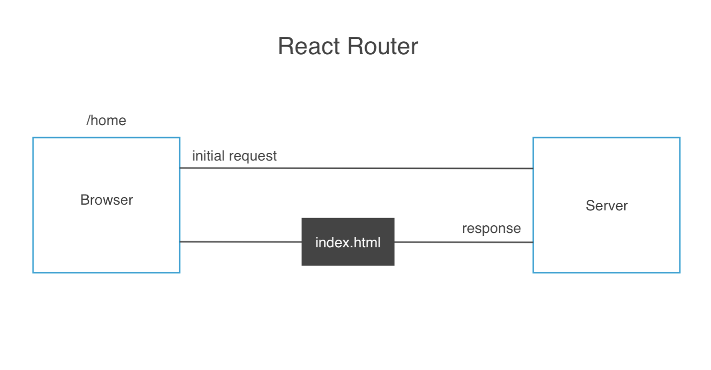
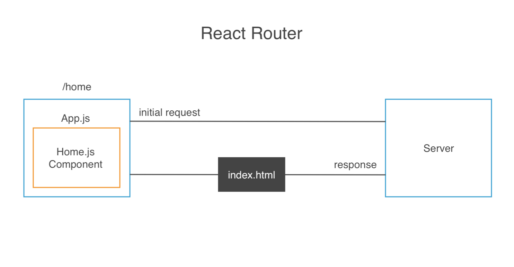
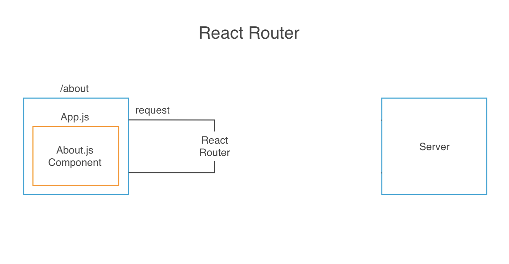
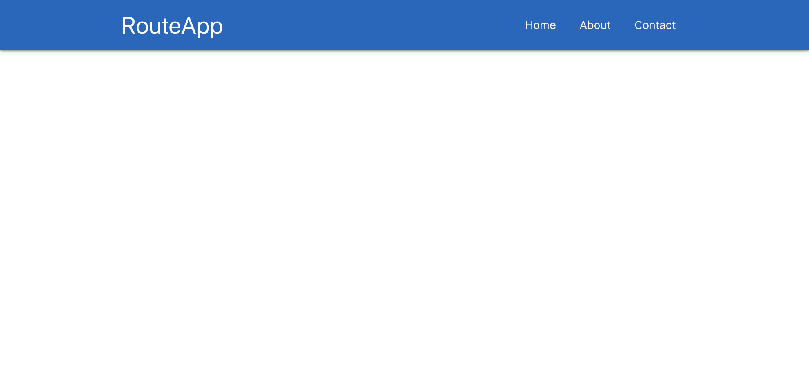

# The React Router

So far, we've been using React to show only one page, but most websites have several pages (home, about, contact, etc).

How do we implement several pages in React?

Well, we already know that React is a single page app, where only one HTML file is sent down to the browser from the server.

So, what happens if we want to see different pages? 

<kbd></kbd>

For example, in the beginning, is we want to make a request from the **/home** page, we make an initial request to the **server**. Then, we get a response which is the **index.html** page and that goes to the browser. 

Now with React, it's going to look at **/home** and think, you're looking at the **/home** page, so it's going to load a **Home.js** component. **App.js** is the Root Component, so it's sitting at the top and this will always be showing in the browser, but React is going to inject the **Home Component** inside **App.js** so we'll see that Home Component when we go to **/home**. This is all coming from React Router.

<kbd></kbd>

Say, we have a Navbar and the user clicks to go to an About page, well, we make that request, but it doesn't go all the was to the server.

<kbd></kbd>

Instead, the React Router intercepts, so it doesn't have to go all the way to the server. Rather, React is going to serve up the About.js component and inject it into App.js instead. This is what the React Router does.

The React Router stops the request from going all the way to server and coming back bc we only need that **index.html** everytime. There's no point of sending it over and over again, instead, it's just injecting the component it needs to show.

# React Router Example with RouteApp

Create a new project with ```create-react-app``` and give it a name of ```routeapp```.

Next, go into **index.html** in the **public** directory and add the CDN link to Materialize CSS, put it above the ```<title>``` tag.

Then, delete some of the default files that comes with the create-react-app package like: logo.svg, App.css and App.test.js. Remember to go into **App.js** and remove the references to those files we've just removed. Also, all the default elements inside the root ```<div>``` tag.

## Get into React Router

To demonstrate React Router, we'll need a few different pages and to do so, we'll mock up some more Components. We'll create three component: About, Home and Contact.

Create a new folder/directory to hold all these new Components and call it **components**.

## Home.js - UI/Functional Component

We won't be using ```state``` in this component. We just need to import the React library from react. Then, create a function ```const Home``` is equal to a function ```= () => {...}``` and in the function, all we need to do for now is ```return``` some JSX with a root ```<div>``` with a class of ```container``` from Materialize to stylize, an ```<h4>``` with the title Home and then some content in s ```<p>```. Use the emmet shortcut in VSCode by typing in **lorem** and the hit tab (you can also put a number after and it'll put that amount of dummy lorem content).

```
import React from 'react'

const Home = () => {
  return(
    <div className="container">
      <h4 className="center">Home</h4>
      <p>Lorem ipsum dolor sit amet, consectetur adipisicing elit. Error placeat dolorum eligendi quae magni, perspiciatis deserunt accusamus dolores at. Enim voluptas quia nulla magnam excepturi totam vitae molestiae deserunt iste?</p>
    </div>
  )
}

export default Home
```

Do the same for About.js and Contact.js and change the titles.

Now, we have three components and will represent our three pages to route around for our example.

## Linking and Navbar.js

Create another component and call it Navbar.js, it also doesn't need state, so it'll be a UI/Functional component. Similar setup as the previous ones.

**Navbar.js**
```
import React from 'react'

const Navbar = () => {
  return(
    <nav className="nav-wrapper blue darken-3">
      <div className="container">
        <a className="brand-logo">RouteApp</a>
        <ul className="right">
          <li><a href="/">Home</a></li>
          <li><a href="/about">About</a></li>
          <li><a href="/contact">Contact</a></li>
        </ul>
      </div>
    </nav>
  )
}

export default Navbar
```

Now that the Navbar.js component has been created, we need to import it into the Root Component, App.js nest it inside so we can display on all pages.

**App.js**
```
import React, { Component } from 'react'
import Navbar from './components/Navbar'

class App extends Component {
  render() {
    return (
      <div className="App">
        <Navbar />
      </div>
    );
  }
}

export default App
```

<kbd></kbd>

## Setup Routes

So when we click on the Navbar for Home, About or Contact, it'll load those components to get us to those pages.

