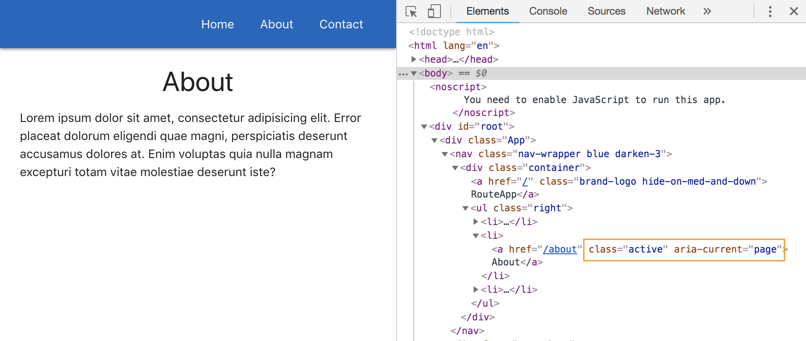

# Router Links and NavLinks

Our RouterApp example is now setup with **React Router** and we're able to get the right componets loaded on the page when the Navbar's tab is clicked on. But, it keeps going back into the server and loading it up. (You can see that the browser keeps reloading and you can also check in the DevTools in the Network tab)

We don't want that. We want React to intercept and load, so it doesn't have to go all the way back to the server to get the reference.

To solve this, all we have to do is in the Navbar component, remove the ```<a>``` anchor tags. Instead, use ```<Link>``` or ```<NavLink>``` from the **react-router-dom** package.

First, we need to import this at the top in the Navbar.js Component ```import { Link, NavLink } from 'react-router-dom'``` and then change the ```<a>``` to ```<Link>``` tags and to it, we need to add the ```to=""``` property, it's kind of like the ```href=""``` attribute.

**Navbar.js**
```
import React from 'react'
import { Link, NavLink } from 'react-router-dom'

const Navbar = () => {
  return(
    <nav className="nav-wrapper blue darken-3">
      <div className="container">
        <a href="/" className="brand-logo hide-on-med-and-down">RouteApp</a>
        <ul className="right">
          <li><Link to="/">Home</Link></li>
          <li><Link to="/about">About</Link></li>
          <li><Link to="/contact">Contact</Link></li>
        </ul>
      </div>
    </nav>
  )
}

export default Navbar
```

Eveything will still work like before. 

## ```<Link>``` tag Under the Hood

But what it does is prevent the default action from occuring when we click on one of the anchor tags. Similar to ```e.preventdefault()``` to prevent submission of a form.

We don't want the anchor ```<a>``` to happen anymore. Instead, we want react-router-dom to take over and just load in the component based on the URL we're going to. It makes the app a lot smoother and quicker bc we don't have to make a request.

Notice now when you click on the Navbar to change pages, it doesn't reload. Yay!

We should always use the ```<Link>``` tag if we want link to a page, actually a component.

## ```<NavLink>``` Explained

When we use this one, it comes with the ```active``` and ```aria-current``` attributes. the previous Link tag doesn't come with it. These attributes show when we are on that Component.

**Navbar.js**
```
import React from 'react'
import { Link, NavLink } from 'react-router-dom'

const Navbar = () => {
  return(
    <nav className="nav-wrapper blue darken-3">
      <div className="container">
        <a href="/" className="brand-logo hide-on-med-and-down">RouteApp</a>
        <ul className="right">
          <li><Link to="/">Home</Link></li>
          <li><NavLink to="/about">About</NavLink></li>
          <li><NavLink to="/contact">Contact</NavLink></li>
        </ul>
      </div>
    </nav>
  )
}

export default Navbar
```

<kbd></kbd>

This is useful if we want to start applying different styles to the active links.