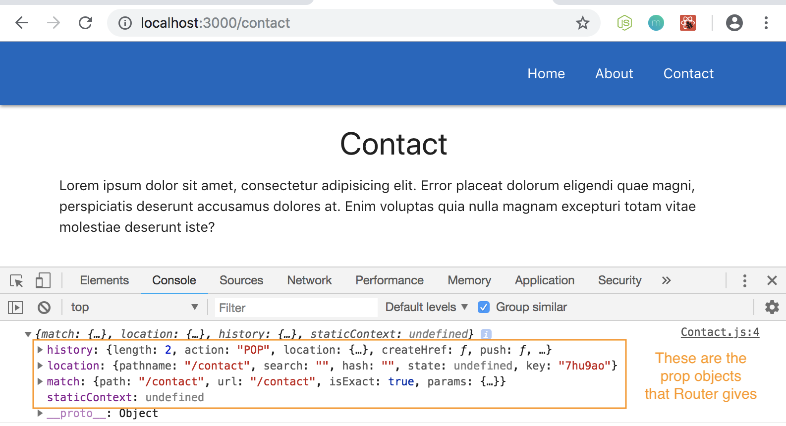
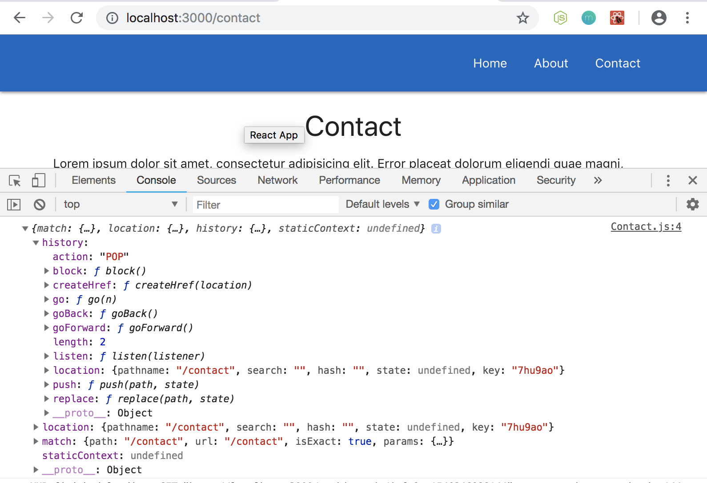
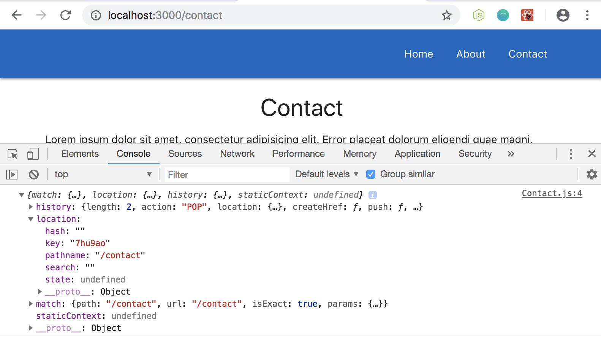

# Programmatic Redirects

We'll learn how to programmatically redirect user to another url. For example, if a User clicks on a button or if they land on a page and want to redirect them.

First, let's start at the Contact.js component. In the ```const Contact``` function, if we take in a ```prop``` as a parameter, we have automatically added to the ```props``` router information and that's bc this is one of the component that the router loads up. So, for any component that the router does load up in:

**Contact.js**
```
const Contact = (props) => {
  return(
    <div className="container">
      <h4 className="center">Contact</h4>
      <p>Lorem ipsum dolor sit amet, consectetur adipisicing elit. Error placeat dolorum eligendi quae magni, perspiciatis deserunt accusamus dolores at. Enim voluptas quia nulla magnam excepturi totam vitae molestiae deserunt iste?</p>
    </div>
  )
}
```

**App.js**
```
<BrowserRouter>
  <div className="App">
    <Navbar />
    <Route exact path='/' component={Home} />
    <Route path='/about' component={About} />
    <Route path='/contact' component={Contact} />
  </div>
</BrowserRouter>
```

these things ```component={Home}```, ```component={About}```, etc. the router will attach some extra info to the ```props``` object. 

We can see it when we log the ```props``` object in Contact.js to see the extra information about the Router on the props object.

<kbd></kbd>

## Router Methods that Comes With It

**history method** - come with a bunch of different methods and properties.

<kbd></kbd>

**location method** - come with a bunch of different methods and properties. It'll also tell us where we're at, like in this example, we're on the Contact page. ```match``` is going to be used for **route parameters** later on.

<kbd></kbd>

## Redirect User to a Different Page with ```setTimeout()```

In this example, we'll make the User land on the Contact page and then after 2 seconds, redirect them to another page.

To do that, we need to use the ```history``` and ```push``` from it from the object on the ```props object```. Create a ```setTimeout()``` and inside its function use ```props.history.push()``` bc remember we're referencing the ```props object```, its ```history``` object and then the history's ```push``` method.

In the ```push``` method, it says we can take the argument of ```path```, which in our example, let's have it as ```/about``` and it'll wait 2 seconds to do it in ```setTimeout()```.

Run it, and it works! So, this is a programmatic redirect. It's just ```props``` dot ```history``` dot ```push()``` method and where we want it to go to.

## Try Redirect in a Different Component