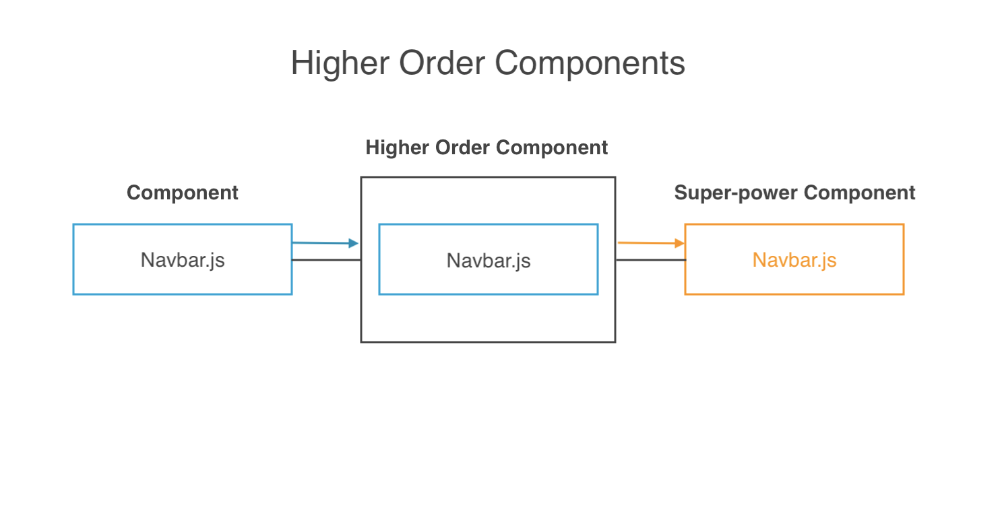
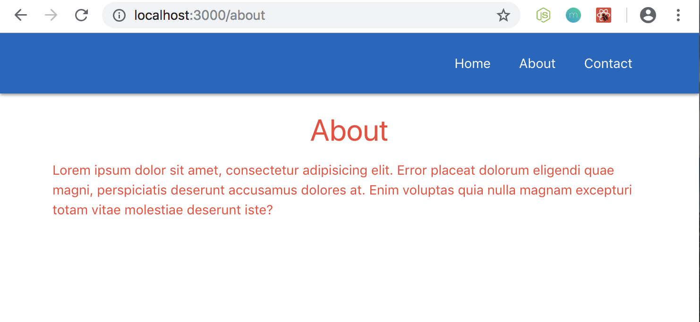

# Higher Order Components

What exactly are **higher order components**? Essentially, they're functions that wrap around other components and give them "super powers", well extra features.

<kbd></kbd>

For example, with our previous example, we have our Navbar.js component, which we then pass into ur higher order component and that higher order component adds functionality to the Navbar.js component, so that it comes out with extra features or super powers.

## Higher Order Component ```withRouter```

In the previous example we saw higher order components using ```withRouter``` from ```react-router-dom``` package. What this did was add ```props``` to the ```props object``` in the Navbar.js component, so we can have information about the Router inside this component.

## Make Our Own Simple Custom ```HOF```

Let's create a new directory inside of our ```/components``` directly to start the example of creating our own custom HOF inside our ```routeapp``` directory example and call it ```hoc``` and create a new file called ```RandomColor.js```

This HOC is going to randomize the text color inside another component. The HOC is just going to be a function. Then, we'll take in the ```WrappedComponent``` as a parameter.

Before, when we used the ```withRouter()``` higher order component, we wrapped the Navbar component at the bottom on the export line with it. So, when we wrap something like that, we recieve the wrapped component as a parameter like:

**RandomColor.js**
```
import React from 'react'

const RandomColor = (WrappedComponent) => {

}
```

So, if we were to use ```RandomColor``` function on another component, like About, then, we'd receive the About component as a parameter in the ```RandomColor``` function. That would be the wrapped component and we have to return it later on bc especially if we want to return a component with extra features.

In this example, we're gonna make it get a random color or a class which represents a random color, so it can be styled that way. Inside the function, create an array ```const colors = ['red', 'blue', 'yellow', 'orange', 'green']``` and then we want to randomize which color we want to choose.

Next, create ```const randomColor = colors[]``` with color array notation bc we want the ```colors[]``` to be a random integer to be between 0-4. To randomize, we'll say ```Math.floor(Math.random() * 3)```. Now, it's going to be a random number between 0-4.

When we apply a Materialize CSS class, to change the color, it's always the color name and then -text like ```blue-text```. So, we want to make a className based on the colors in our array. Create ```const materializeClass = randomColor + '-text';``` as you can see, we're concatenating in the ```randomColor``` with ```'-text'``` to get that Materialize CSS class.

**RandomColor.js**
```
  const colors = ['red', 'blue', 'yellow', 'orange', 'green'];
  const randomColor = colors[Math.floor(Math.random() * 3)];
  const className = randomColor + '-text';
```

Remember, we have to return the wrapped component at the end with extra features, or aka super powers, so, we'll return a function and this function will take in the ```props``` which would've been passed into ```WrappedComponent```. For example, if the About.js component recieves any ```props```, then it would be passed into the RandomColor.js component as well.

So, this function needs to return some JSX, and it could return just the wrapped component or we can surround that wrapped component with other JSX.

**RandomColor.js**
```
return (props) => {
  return (
    <div className={materializeClass}></div>
  )
}
```

The ```<div>``` will have a ```className={materializeClass}``` with curly braces bc we want to return something dynamic. Then, this ```<div>``` is going to surround the ```WrappedComponent```.

**RandomColor.js**
```
import React from 'react'

const RandomColor = (WrappedComponent) => {

  const colors = ['red', 'blue', 'yellow', 'orange', 'green'];
  const randomColor = colors[Math.floor(Math.random() * 3)];
  const materializeClass = randomColor + '-text';

  return (props) => {
    return (
      <div className={materializeClass}>
        <WrappedComponent />
      </div>
    )
  }

}

export default RandomColor
```

So now, when we return this RandomColor component, it should return the About component, but there's going to be and extra ```<div>``` arround:

**About.js**
```
const About = () => {
  return(
    <div className="container">
      <h4 className="center">About</h4>
      <p>Lorem ipsum dolor sit amet, consectetur adipisicing elit. Error placeat dolorum eligendi quae magni, perspiciatis deserunt accusamus dolores at. Enim voluptas quia nulla magnam excepturi totam vitae molestiae deserunt iste?</p>
    </div>
  )
}
```

And that ```<div>``` is going to have a ```className``` of the class colors from Materialize CSS based on the colors in the array we created.

## What about the ```props```

If RandomColor.js recieves ```props```, well, in order to access and use them, inside the About.js component, passed in as parameter, then we need to need to pass them down into the ```<WrappedComponent />``` line in RandomColor.js. The way to do that is with ```{}``` curly braces and then the ```...``` spread operator and ```props``` like: ```<WrappedComponent {...props}/>```

Remember to ```export``` the component at the bottom in RandomColor.js

Also, remember to ```import``` on top in the About.js component.

**About.js**
```
import React from 'react'
import RandomColor from '../hoc/RandomColor'

const About = () => {
  return(
    <div className="container">
      <h4 className="center">About</h4>
      <p>Lorem ipsum dolor sit amet, consectetur adipisicing elit. Error placeat dolorum eligendi quae magni, perspiciatis deserunt accusamus dolores at. Enim voluptas quia nulla magnam excepturi totam vitae molestiae deserunt iste?</p>
    </div>
  )
}

export default RandomColor(About)
```

<kbd></kbd>

Each time you refresh, you'll get a different random color on the text.

We've created a custom higher order component which is giving the text a random color each time and all there is to it, is to create a function, pass in the ```WrappedComponent``` as its parameter, do something in here, then return the original component and extra stuff if we want to, and then we export it and we use it on the component itself.

Learn more about higher order compoponents: https://reactjs.org/docs/higher-order-components.html