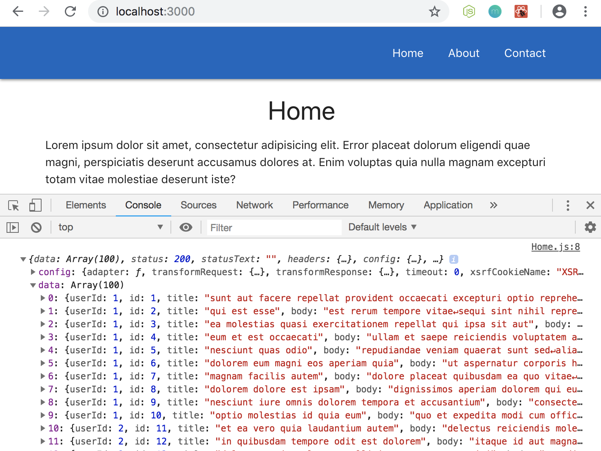

# Using Axios

Usually with a website we want to be grabbing data and showing it on our website. Rhis could be from some kind of REST API on your server of some other third party API, or a service like Firbase that goes directly to the database.

In this example to practice, we'll use a third party REST API to get some dummy data from. We're gonna use JSON Placeholder: https://jsonplaceholder.typicode.com/

JSON Placeholder will give us access to some REST API endpoints to receive some dummy data.

## How to Get and Use the Data - Using Axios

We're gonna use **Axios** an HTTP Request Library. We'll need to install it as a separate package to our continuing ```routeapp``` example. In the terminal ```npm install axios```

Now, we can use Axios inside a component, to go out and fetch data from an external source. 

## Explain Use ```componentDidMount``` and Axios to Grab Data

Remember when we talked about **lifecycle hooks** a good place to go out and get external data was in the lifecycle hook ```componentDidMount```, this is when the component has then mounted to the DOM.

So, we're gonna use ```componentDidMount``` lifecycle hook to go out and grab 
data using Axios.

## Convert from Functional to Class-based Component

To use a lifecycle hook inside a component, we have to convert the component into a **Class-based Component** bc functional components cannot use the lifecycle hooks.

We'll work with the Home.js component, let's convert it from a functional component to a Class-based component in order to use lifecyle hook of ```componentDidMount```.

**Home.js** - functional component version
```
import React from 'react'

const Home = () => {
  return(
    <div className="container">
      <h4 className="center">Home</h4>
      <p>Lorem ipsum dolor sit amet, consectetur adipisicing elit. Error placeat dolorum eligendi quae magni, perspiciatis deserunt accusamus dolores at. Enim voluptas quia nulla magnam excepturi totam vitae molestiae deserunt iste?</p>
    </div>
  )
}

export default Home
```

To convert, first, we'll need the import ```{ Component }``` from React and get rid of ```const Home = () =>``` and change it to ```class Home extends Component```.

Next, we have to embed our ```return(...)``` JSX in a ```render()``` method.

**Home.js** - Class-based component version
```
import React, { Component }from 'react'

class Home extends Component {
  render() {
    return(
      <div className="container">
        <h4 className="center">Home</h4>
        <p>Lorem ipsum dolor sit amet, consectetur adipisicing elit. Error placeat dolorum eligendi quae magni, perspiciatis deserunt accusamus dolores at. Enim voluptas quia nulla magnam excepturi totam vitae molestiae deserunt iste?</p>
      </div>
    )
  }
}

export default Home
```

## Create ```componentDidMount()```

Above the ```render()``` method, add ```componentDidMount()```.  Inside ```componentDidMount() {...}``` curly braces, this is where we use Axios to go out and grab the data. (NOTE: You can also use Fetch API too)

So first, we need to ```import axios from 'axios'``` at the top of the componet.

Next, where gonna play around the GET request with ```axios.get()```. The first parameter in the GET request will be the http link and the end point we want like, ```axios.get('https://jsonplaceholder.typicode.com/posts')```, and this is **asynchronous**, meaning it takes some time to go and do something, it reutrns a **Promise**. 

  * **Asynchronous** - takes time to do something.
  * **Promise** - means this action will complete at some point in time and we need to add on ```.then``` method.
  * **```.then()```** - this method fires once a request like, ```axios.get('https://jsonplaceholder.typicode.com/posts')``` has been completed, so any code we want inside this ```.then()``` method, that will only run after the request has been completed.

### Inside ```.then()``` method

We need to pass a **callback function** when it completes and that callback function takes the **```response``` object** from ```axios.get('https://jsonplaceholder.typicode.com/posts')``` as a parameter. Let's log it into the console to see what we're getting.

**Home.js**
```
import React, { Component }from 'react'
import axios from 'axios'

class Home extends Component {
  componentDidMount() {
    axios.get('https://jsonplaceholder.typicode.com/posts')
      .then(response => {
        console.log(response)
      })
  }
...
```

<kbd></kbd>

You'll see that we have a property called ```data``` and this is all the data we've recieved from our external API and we're getting 100 posts and each one is an object.