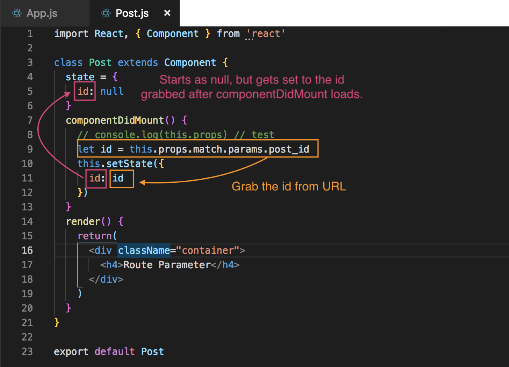
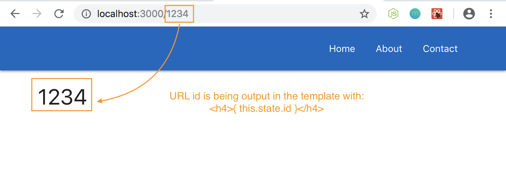
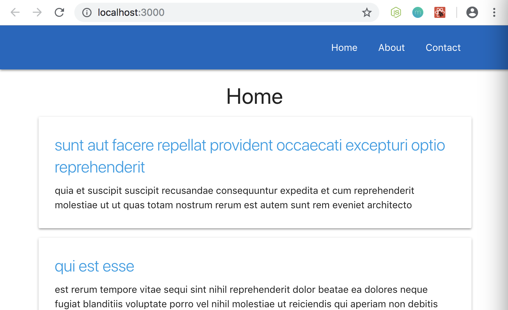
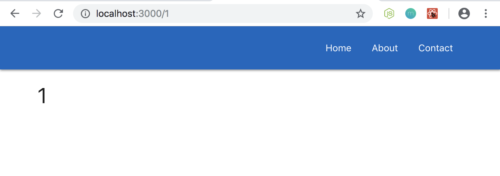

# Route Parameters

* They're a part of a URL that can change
* We usually see them on URLs for individual records like the following:

Examples:

* User's Profile Page: myboard.com/users/**rider01**
* User's Profile Page: myboard.com/users/**maybear91**
* Cooking Recipe Page: chefsboard.com/recipes/**cookies**
* Cooking Recipe Page: chefsboard.com/recipes/**brownies**

As you can see the beginning portion stays the same, but the ends are different. Also, each page template is gonna be the same, but the data shown is different based on the URL, the ending, what it represents.

Those endings of a URL are the **Route Parameters**

## Our ```routeapp``` and Turn Posts into Separate Page

When we click on the post card on the Home page, then it's going to take us to a URL with ```/id``` of whatever that post is. And when we land on that page, it's going to show us the post details for that page. So, the post's ```id``` is going to be the Route Parameter.

## How do we Setup a Route for This?

We need to go into App.js bc that's where our Route is setup. Create another ```<Route />``` under the other Routes.

```
<Route path='...' component={...} />
```

For ```path=```, how do we define that we're expecting a Route Parameter? Something that's going to be a variable or will change? To define a Route Parameter, we use ```:``` a colon, then we give that Route Parameter a name. The name can be whatever you want, but at least make it logical. In this example, we'll call it ```path='/:post_id'```. If the ```path='/:post_id'``` matches the post id, then it'll show that content.

Also, create the component, ```component={Post}```. Remember to create a Post.js file as well.

## Create Post.js Component

We'll be using ```state``` here, so we'll need to have this component be a Class-based component.

**Post.js**
```
import React, { Component } from 'react'

class Post extends Component {
  render() {
    return(
      <div className="container">
        <h4>Route Parameter</h4>
      </div>
    )
  }
}

export default Post
```

When this component is loaded up, we're gonna try to identify what the Route Parameter is bc we need to know that post ```id``` in order to know what post we want to show here, we need to know the ```id``` of that post, so we can request it.

Go back to App.js and import the Post.js component and also add it in the Route line with ```component={...}```.

<kbd></kbd>

Run it and test it out and we'll see the ```<h4>``` title that we hard coded in for now. 

## ```componentDidMount()``` Hook to Fetch Data in Post.js

How do we identify the Route Parameter inside Post.js component, so we know what data to fetch?

In Post.js, add the ```componentDidMount()``` function above the ```render()``` method. Test it out with console.log to see what we get. Remember, we automatically get ```props``` in Class-based components and when this component is being used as a Route, then we get access to that extra route info on the **props object** automatically.

The way we find the Route Parameter is by using the extra info that the React Router provides to us on the ```props``` object. So, we can grab that by saying ```this.props.match.params``` and then the name of our Route Parameter. Inside App.js, we called our Route Parameter ```post_id```, so here, we need to say ```this.props.match.params.post_id```

**Post.js**
```
componentDidMount() {
  console.log(this.props) // test
  let id = this.props.match.params.post_id
}
```

<kbd></kbd>

You see that we have an Object that comes with different properties. In the ```match``` property, inside of it, there's a property called ```params``` and also our property that we created ```post_id``` and it's grabbing the value of the ending of the URL.

<kbd></kbd>

So, inside a component, we can identify what the Route Parameter is and that's is awesome! Then, inside the component, we knew which post to go out and grab using some kind of HTTP request.

## Create ```state``` in Post.js Component

Next, let's create ```state``` and set it to an object and we'll store a property calle ```id```. To start for this property, when the component first loads, it's gonna be ```null```, but then when ```componentDidMount()``` fires, we're gonna grab the ```id``` from the URL and we're going to ```setState()``` so that the ```id``` in ```state``` then becomes the ```id``` from the URL.

We're keeping track of the URL ```id``` inside ```state``` of this component.

**Post.js**
```
import React, { Component } from 'react'

class Post extends Component {
  state = {
    id: null
  }
  componentDidMount() {
    // console.log(this.props) // test
    let id = this.props.match.params.post_id
    this.setState({
      id: id
    })
  }
 ... 
```

<kbd></kbd>

## Template, Output the id

```
import React, { Component } from 'react'

class Post extends Component {
  state = {
    id: null
  }
  componentDidMount() {
    // console.log(this.props) // test
    let id = this.props.match.params.post_id
    this.setState({
      id: id
    })
  }
  render() {
    return(
      <div className="container">
        <h4>{ this.state.id }</h4>
      </div>
    )
  }
}

export default Post
```

<kbd></kbd>

Whenever you change the URL ```id```, it's going to change it in the template as well.

This is the basics of Route Parameters and how to grab that Route Parameter inside a component.

Next, we'll learn how to set up the links from when we're outputting each individual posts from Home.js component when the user click on that post.

## Link-up Different Posts from Home.js to Individual Post page

First, in Home.js, we need to surround the title of the post with a ```<Link>``` tag, and that'll link us to that separate component. In the two property, we need to pass through as a Route Parameter the ```id``` of each one of the posts.

We have access to those ```id``` bc we output the id into the ```key``` in:

**Home.js**
```
...
  render() {
    const { posts } = this.state
    const postList = posts.length ? (
      posts.map(post => {
        return(
          <div className="post card" key={post.id} >
            <div className="card-content">
              <span className="card-title">{post.title}</span>
              <p>{post.body}</p>
            </div>
          </div>
        )
      })
  ...    
```

So next, we need to surround the ```<span className="card-title">{post.title}</span>``` with a ```<Link>``` tag in the two property of that Link tag, we need to say ```post.id```

First, we need to import the ```<Link>``` tag from the React Router package with ```import { Link } from 'react-router-dom'```. Now we can use the Link tag in our template surrounding the ```<span>``` tag. 

The Link property of ```to={...}``` is going to equal to something dynamic to dynamically input the post id. Inside the curly braces, we'll have ```'/'``` and concatenate ```+``` with a ```post.id```. The result here is going to something like ```/1``` or ```/2``` relevant to the post id.

Our dynamic Link is done now.

<kbd></kbd>

The titles are now blue bc default style for links.

<kbd></kbd>

When we click on the title link, it takes us to the post's id page associated to the post we clicked on. We get the id and it's output to the page. Each time we click on a different post, it's a different id.

## Output Post Data Instead of Just Id

In Post.js, we need to import axios so we can make that HTTP request to grab individual post id from JSON Placeholder address like how we did before in Home.js get request.

