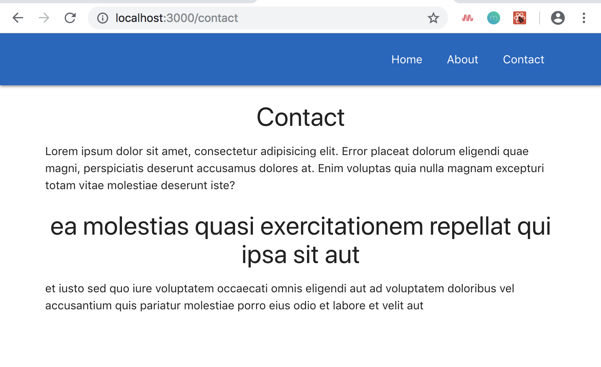

# Switch Tag

<kbd></kbd>

Remember, in App.js, we setup the URL to be ```/:post_id``` in ```<Route path='/:post_id' component={Post} />```, so, whatever we put after the ```/```, it's going to treat it as a ```post_id```. We need to address this issue in dealing with the Contact and About pages.

We need to make it clearer that ```<Route path='/:post_id' component={Post} />``` has to be a number or it can't be the Contact or About or whatever page.

Creating a condition that only loads one of the two, if it's one thing or the other.

## Way 1, Restructure the URL Path

One way is to change to ```<Route path='/post/:post_id' component={Post} />``` in App.js and then change the ```<Link to={'/' + post.id}>``` in Home.js to ```<Link to={'/post/' + post.id}>```

**App.js**
```
<Route path='/post/:post_id' component={Post} />
```

**Home.js**
```
<Link to={'/post/' + post.id}>
  <span className="card-title">{post.title}</span>
</Link>
```

## Way 2, With a **Switch Tag**

In App.js, add ```Switch``` from ```'react-router-dom'``` and then surround all of the Routes lines in the ```render()``` method, with the ```Switch``` tag.

**App.js**
```
class App extends Component {
  render() {
    return (
      <BrowserRouter>
        <div className="App">
          <Navbar />
          <Switch>
            <Route exact path='/' component={Home} />
            <Route path='/about' component={About} />
            <Route path='/contact' component={Contact} />
            <Route path='/:post_id' component={Post} />
          </Switch>
        </div>
      </BrowserRouter>
    );
  }
}
```

What the ```<Switch>``` tag is saying is that, at any point in time, we only want these Routes to take precedence. We don't want to match two at a time. We only want to match one at a time.

So, when we type in the URL or link something relevant to the link on navbar, links or button, it will look at the URL and then it will start at the top of the Route tag stack, and it will scan down checking for a match.