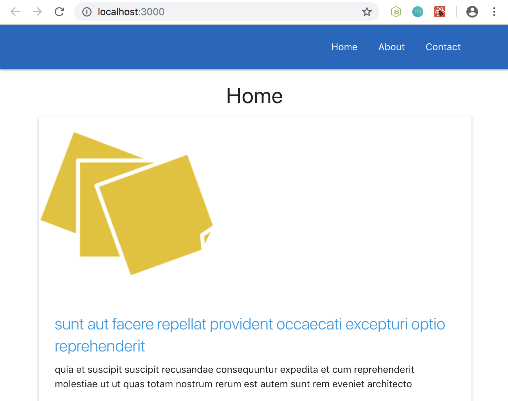

# Importing Images to React

Here, we'll learn how to use images inside our React components. We're gonna add an image to the background to each one of the posts on the Home page.

First, we need to add an image file into the ```src``` directory, and then we'll use this image inside the whole component. 

Next, we need to ```import``` that image, give it a name, ```from```, then we jump out of the current directory using ```../``` where Home is located bc it's inside ```components``` directory, in order to be in the ```src``` level to grab the image file.

Then, we use the name that we created for the image in the JSX template. We want to output it for each individual post. In the `````` tag, for the ```src="..."```, it's going to be the image name we gave to the image file ```StickyNote``` in cruly braces, remove the default quotes that comes with ```src```.

<kbd></kbd>

## Edit Image Styling in CSS 

