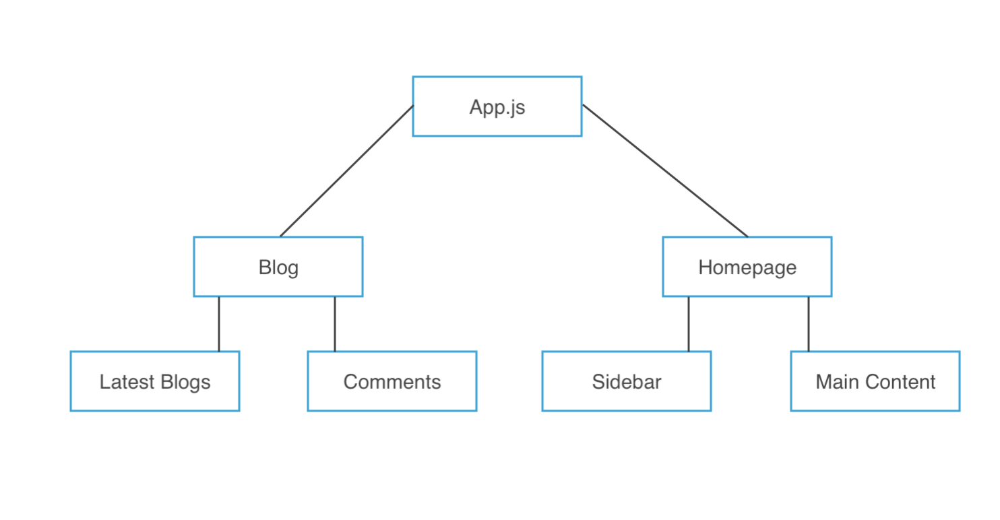
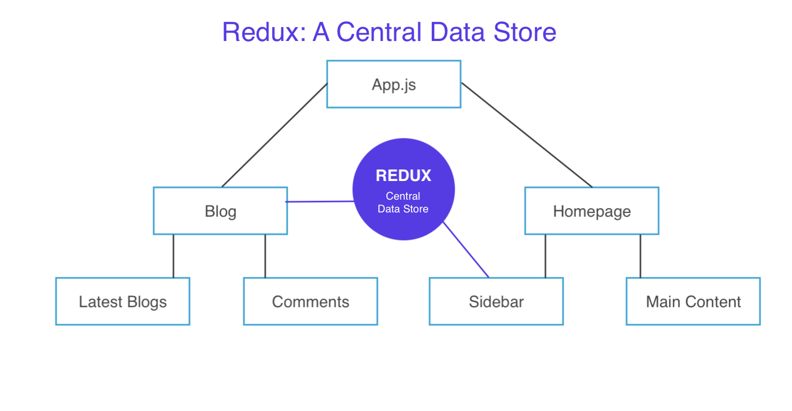

# Intro to Redux

* Central data stare for all application data
* Any component in our application can access data from this central data store
* Makes state management easy

<kbd></kbd>

This is a component structure of a simple application with a few different components.

Imagine we have a Latest Blog component that will show the latest blogs from some data that we get from an external source, but on the Homepage component, on the Sidebar component, we also want to show some latest blogs. In this case, we pretty much want to share the data in two locations, the Sidebar component and the Latest Blogs component needs it.

**Blog Component and Passing Data**

What we could do in the Blog component, we can reach out, grab some data from an external source, store it in the ```state``` of this Blog component, and then pass it down as ```props``` to the Latest Blog component.

**What About the Sidebar component?**

We could do the same thing on the Homepage componet as we did for the Blog component, grab data from external source and store it in the ```state```, but that woul be duplicating our code, which is not the best method. Another, would be to start from the Blog component, pass it up to App component and down to Homepage and then Sidebar, but this is also not the good way of doing it.

## Redux: The Central Store of Data

To solve this issue, use **Redux**, which is a central data store, and we can store all of our data that we need for the application that is going to be shared between components inside the **Redux store**, the central store of data.

<kbd></kbd>

So, if this Blog component wants some data of the latest blogs, it can reach out into Redux and grab the data and then pass it down into the Latest Blog component.

Same goes for the Sidebar component, if it wants to get data for the latest blogs, it can reach into Redux central store and grab that data.

There no need of data being passed between different components around the whole application and we also don't need to duplicate our code.

This is a simple example of how Redux solves the problem of components grabbing data.

