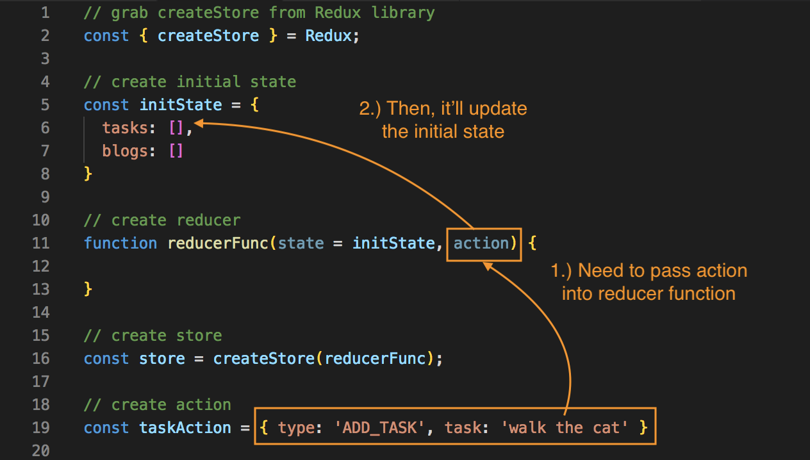

# Redux Store and How to Setup

<kbd></kbd>

The **Redux central data store** is a JavaScript object, which will represent our **global ```state```** of the application.

The **reducer**, is a function that interacts with the **redux store** in order to change the ```state``` of it, or the data inside of it.

Think of the **redux store** as a warehouse storing the ```state``` of tons of items, data. Think of the **reducer** as a guard, who's guarding the warehouse and letting only special employees to go in to change or update items in the warehouse, the store.

When **actions** are dispatched from somewhere else, goes to the **reducer** and then updates the **redux store**, the warehouse. It's always being updated from one single place, it's happening from the **reducer**.

**Actions** are handed to the **reducer** and the reducer makes those changes to the **redux store** depending on which action it has been passed. 

So, the **reducer function** and the **redux store** are coupled with each other. Whenever we create a **redux store**, we have to pass that **store** a single **reducer function** as a parameter to that store. That way, the store will know which reducer is going to handle those changes.

## Create a Simple Redux Store

Use the CDN: ```<script src="https://cdnjs.cloudflare.com/ajax/libs/react-redux/4.4.5/react-redux.min.js"></script>```

Next, create a **store** so we can get something from the Redux library from our CDN link. It'll enable us to create that store. Create a ```const``` and use destructuring and grab ```createStore``` from Redux. 

**app.js**
```
const { createStore } = Redux;
```

Then, create a **store** and make it equal to ```createStore``` which we grab from ```const { createStore } = Redux``` and then invoke that function bc ```createStore()``` is a function.

**app.js**
```
const store = createStore();
```

Remember that the **store** is tightly coupled with a **reducer**, and we pass a reducer into the store as a parameter, so that we know that those two are linked together. And, the store knows which reducer is going to be interacting with it. So, we need to pass a reducer to ```createStore()``` as a parameter.

## Create Reducer Function

Our **reducer function** is just a that interacts with the **store**, so we'll have to create that function. We'll call it ```reducerfunc``` and this function, inside is going to take two parameters where the it'll interact with the actual store to change the ```state```, but it'll take two parameters. We take the ```state``` and we take the ```action``` as well.

**app.js**
```
function reducerFunc(state, action) {

}
```

The first parameter, ```state```, is the **state** of the **store**. When the **reducer** first interacts with the **store**, it's not going to know the **state** then it's not going to exist, so we have to create an initial state to begin with for the **store**. Then, when it first states, it passes that initial state into the store via this reducer and it can set as that.

## Create Initial State

So, we need to create the initial state with ```const iniitState``` and equal to an object with a property of ```tasks``` and starts with an empty array ```[]```. Also, create another property called blogs and also start it with an empty array.

**app.js**
```
const initState = {
  tasks: [],
  blogs: []
}
```

## Pass Default State

To pass a default state into the ```reducerFunc```, as the parameter we need to assign the ```state``` parameter to the ```initState``` we created.

**app.js**
```
// create initial state
const initState = {
  tasks: [],
  blogs: []
}

// create reducer
function reducerFunc(state = initState, action) {

}
```

When this reducer fires, it's going to notice that we don't have a state, that's why we have to assign it to ```initState``` so then, it'll pass all the info of empty arrays for those properties from that initial state.

We have now, our reducer function set with an initial state, and we've also passed it into the ```createStore(reducerFunc)``` method on ```const store```, and the ```reducerFunc``` is going to interact with it.

# Redux Actions

**app.js**
```
// grab createStore from Redux library
const { createStore } = Redux;

// create initial state
const initState = {
  tasks: [],
  blogs: []
}

// create reducer
function reducerFunc(state = initState, action) {

}

// create store
const store = createStore(reducerfunc);
```

We have our ```store``` created with the ```createStore()``` method and we pass in ``````reducerFunc``` as its parameter, so the ```store``` knows which reducer is going to interact with it.

Remember, our reducer, ```reducerFunc``` is just a function and it takes in the ```state``` which represents the state of the ```store``` with an initial value we created with ```initState```. We also have the ```action``` as its second parameter.

If we want to edit the date in the ```store```, we don't edit it directly, we go through the a process we first have to dispatch an ```action``` into the ```reducer```, so it takes the ```action``` then inside the function, we look at the action and change the state on the store based on the action and remember we have access to the state, so this is where we can update it.

So, we'll need to create an ```action``` next. An ```action``` is just a JavaScript object and it has a type property and that describes the action and it also has an optional ```payload``` of data. 

For example, if we create a new action here, we'll store this in a ```const``` and call it ```taskAction```. We're gonna add tasks using an action. We'll set this equl to a JavaScript object that's what an action is and it has a **type property** with all caps. This describes the type of this action, what it's meant to do, so in this example, we want to add a task. Then, we have an optional ```payload``` of data that we can add to it, here, we'll call it ```task``` and pass the value of a string ```'walk the cat'```.

**app.js**
```
const taskAction = { type: 'ADD_TASK', task: 'walk the cat' }
```

What's happening here is that we're creating an ```action```, which we're going to pass into the ```reducer``` function.

<kbd></kbd>