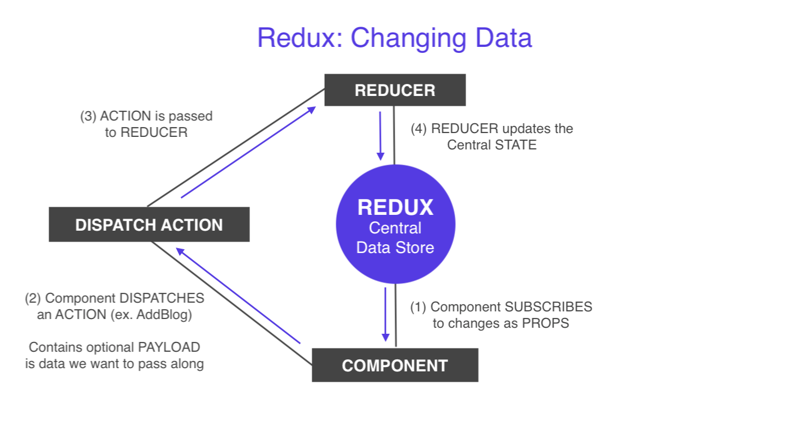

# Redux Store and How to Setup

<kbd></kbd>

The **Redux central data store** is a JavaScript object, which will represent our **global ```state```** of the application.

The **reducer**, is a function that interacts with the **redux store** in order to change the ```state``` of it, or the data inside of it.

Think of the **redux store** as a warehouse storing the ```state``` of tons of items, data. Think of the **reducer** as a guard, who's guarding the warehouse and letting only special employees to go in to change or update items in the warehouse, the store.

When **actions** are dispatched from somewhere else, goes to the **reducer** and then updates the **redux store**, the warehouse. It's always being updated from one single place, it's happening from the **reducer**.

**Actions** are handed to the **reducer** and the reducer makes those changes to the **redux store** depending on which action it has been passed. 

So, the **reducer function** and the **redux store** are coupled with each other. Whenever we create a **redux store**, we have to pass that **store** a single **reducer function** as a parameter to that store. That way, the store will know which reducer is going to handle those changes.

## Create a Simple Redux Store

