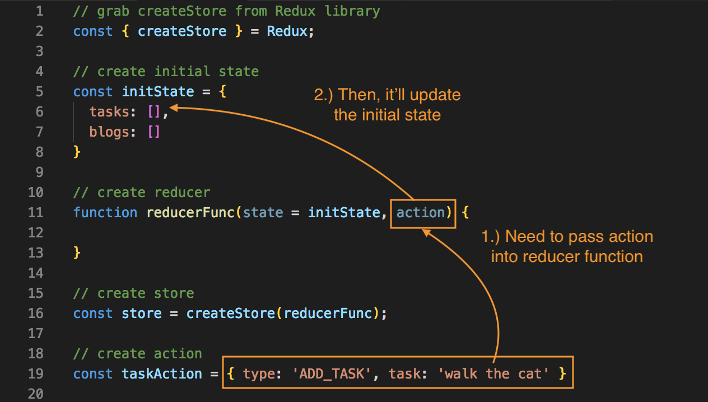
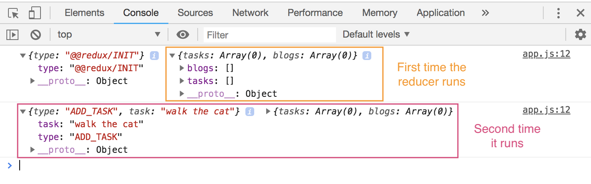

# Redux Actions

We have our ```store``` created with the ```createStore()``` method and we pass in ``````reducerFunc``` as its parameter, so the ```store``` knows which reducer is going to interact with it.

Remember, our reducer, ```reducerFunc``` is just a function and it takes in the ```state``` which represents the state of the ```store``` with an initial value we created with ```initState```. We also have the ```action``` as its second parameter.

If we want to edit the date in the ```store```, we don't edit it directly, we go through the a process we first have to dispatch an ```action``` into the ```reducer```, so it takes the ```action``` then inside the function, we look at the action and change the state on the store based on the action and remember we have access to the state, so this is where we can update it.

So, we'll need to create an ```action``` next. An ```action``` is just a JavaScript object and it has a type property and that describes the action and it also has an optional ```payload``` of data. 

For example, if we create a new action here, we'll store this in a ```const``` and call it ```taskAction```. We're gonna add tasks using an action. We'll set this equl to a JavaScript object that's what an action is and it has a **type property** with all caps. This describes the type of this action, what it's meant to do, so in this example, we want to add a task. Then, we have an optional ```payload``` of data that we can add to it, here, we'll call it ```task``` and pass the value of a string ```'walk the cat'```.

**app.js**
```
const taskAction = { type: 'ADD_TASK', task: 'walk the cat' }
```

What's happening here is that we're creating an ```action```, which we're going to pass into the ```reducer``` function, we're dispatching it into the reducer function. 

<kbd></kbd>

The reducer will take that action, read and see what it's supposed to do, then it'll know it has to add a new task to the state in initState, and the task it needs to add is 'walk the cat'.

We have our action setup, but we haven't actually dispatched it yet to the reducer function, we'll code that next.

## Dispatch ```action```

To dispatch an action, we need to take our ```store``` that we created and then use the method ```.dispatch()``` and inside the parentheses of the dispatch method, we need to pass the action we want to dispatch, so we'd pass in the variable name of our action, which is ```taskAction```.

<kbd></kbd>

What's happening here, it's saying dispatch this ```taskAction```, which means send it to the reducer function, ```reducerFunc```, and that reducer function is going to run. We also have access to the action now, which is ```{ type: 'ADD_TASK', task: 'walk the cat' }``` that we passed in to ```taskAction```. Now, we can do something with it.

To test it out, let's console.log the actual action.

<kbd></kbd>

The first time it runs, we create the store and pass the ```reducerFunc``` into it, so it runs once before we dispatch any action, then we get that second Object of the state bc we're running it to the console.

So, the second time it runs is when we dispatch the ```action``` with the task and the type.

Typically, we can use a ```dispatch()``` from a component to update the ```state``` that's going to go to the reducer and do something with the action and then manipulate the state.