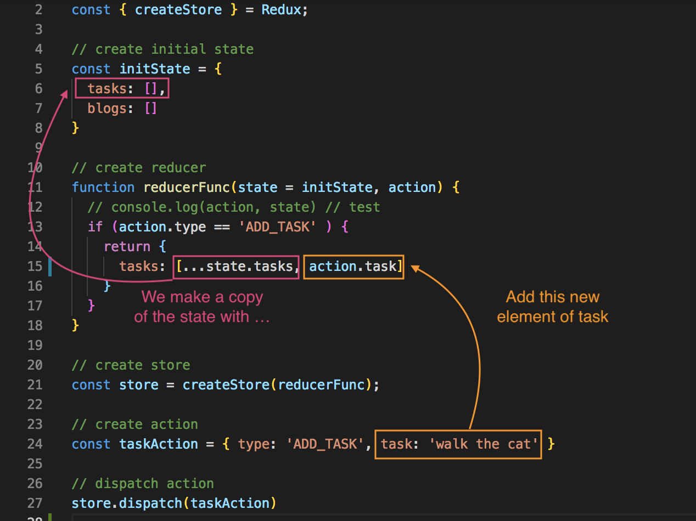

# Redux Reducer

We need to check what type of action we receive and then manipulate the state depending on what type of action it is.

We'll need to do an **if statement** check to see what kind of action that we're receiving. So, if ```if (action.type == 'ADD_TASK' )```, then we're going to want to update the ```state``` by returning a new object that represents the new state of the store. 

In this case, we want to update with task and then to an empty array bc we don't want to edit the state directly. We'll have to update through a non-destructive way, which is with the spread operator: ```tasks: [...state.tasks, action.todo]```

<kbd></kbd>