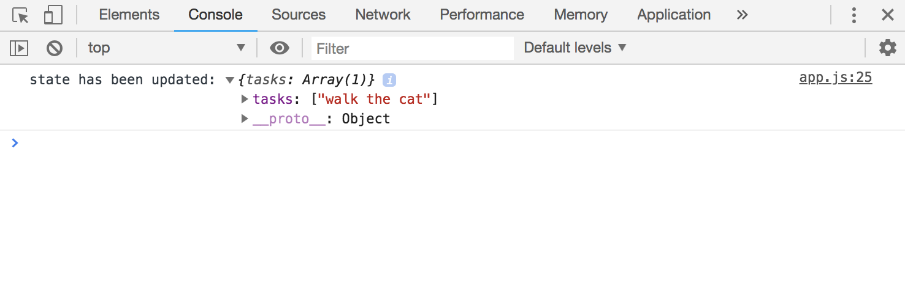
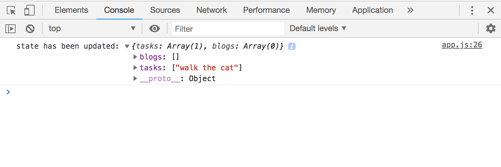
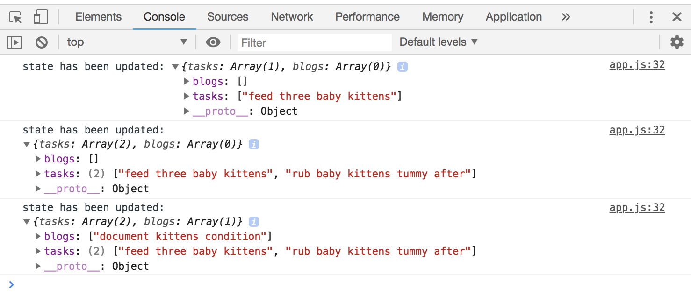

# Redux Store Subscribe

It's normally done in a component, but we'll do a simple example of subscription and log it into the console when we get a change. This is just to get a basic idea, in a component, it's slightly different.

We need to create a subscription with ```store.subscribe()```, subcribe is a function and it takes in function ```() => {...}``` as a parameter. This is going to fire everytime the ```state``` is changed. So, everytime that happens, let's console.log the state with ```store.getState()``` which is a function and it's going to get the state for us and then log it to the console.

```
// create initial state
const initState = {
  tasks: [],
  posts: []
}

// create reducer
function reducerFunc(state = initState, action) {
  // console.log(action, state) // test
  if (action.type == 'ADD_TASK' ) {
    return {
      tasks: [...state.tasks, action.task]
    }
  }
}
```

<kbd></kbd>

It works! We've dispatched the action, then it's passed into the reducer where we update the state and then we've passed back a new state object. Also, because the state has changed and we subscribed to that, then it's going to fire the function inside ```subscribe()``` which we're told it to log a message with the state using ```store.getState()```.

But notice in the log, we only get the tasks and not posts from the state. The problem is bc when we're returning an object, this is the new state object, so that means we've overwritten the old one. So, it bascially got rid of posts.

In this case, we also have to pass in the info that we want to or need to change. Essentially, the properties in the initial state, just include it in the return in the reducer function as well. 

We can do that by returning ```...state,``` this'll make a copy of the initial state.

<kbd></kbd>

Now you can see that we also have posts.

## Dispatch More Actions

Create dispatch with actions:

```
store.dispatch({ type: 'ADD_TASK', task: 'feed three baby kittens' });
store.dispatch({ type: 'ADD_TASK', task: 'rub baby kittens tummy after' });
store.dispatch({ type: 'ADD_BLOG', blog: 'document kittens condition' });
```

Reducer funtion with returns to process actions:

```
function reducerFunc(state = initState, action) {
  if (action.type == 'ADD_TASK' ) {
    return {
      ...state,
      tasks: [...state.tasks, action.task]
    }
  }
  if (action.type == 'ADD_BLOG' ) {
    return {
      ...state,
      posts: [...state.posts, action.blog]
    }
  }
}
```

It's logging in the console bc:

```
store.subscribe(() => {
  console.log('state has been updated:', store.getState());
})
```

<kbd></kbd>

* The first one we've added a task.
* Second run, we've added another task.
* The third, we've added a blog.

This is the basics of Redux :) 

* We dispatch an action to change state.
* The dispatched action is passed into the reducer.
* The reducer takes that action, checks what kind of action it is, and then update the state in store.
* Then, we subscribe to store and react to it (like logging into the console or attach that data as a prop to the component, so we can use them)