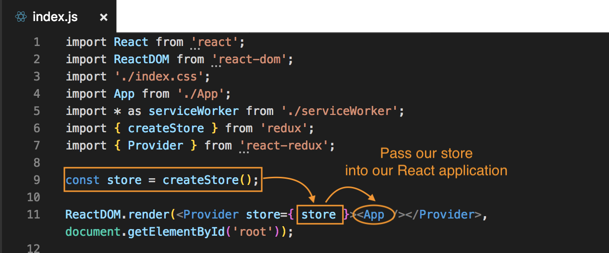

# React and Redux Setup

In this example, we'll add on to the **routeapp** project example we did previously.

* **Redux package** - a library we use to create the **central store**.

* **React Redux package** - is a library that helps us connect our Redux store to our React application; it's gonna be the thing that allows us to connect our components to the central store of data and interact with it. Think of it as the bridge or the blue between the two, the React application and the Redux store.

Install via ```npm install redux react-redux```

## Create Our Redux Store

Go to **index.js** bc this is where we render our React app. We'll need to import the two packages that we installed to the project. 

We need to import the store from the Redux library with ```import {createStore } from 'redux'``` and then ```const store = createStore``` and invoke that ```createStore``` function with ```()```. Remember at some point, we have to pass in our reducer into the createStore function.

## How Does React Interact with Our Redux Store?

How do we associate the **store** with our React application? To do that, the ```react-redux``` package that we installed helps us with that. What we have to import from that package is a component called ```Provider```.

```
import { Provider } from 'react-redux';
```

* **Provider** - is a component which we'll have to surround and wrap the ```<App />```, the Root Component, then, we'll pass our store into that ```Provider```, and that will provide our application with the ```store``` so that the store can then interact with it at a later point in time.

We'll wrap ```<App />``` with ```<Provider>``` and inside that Provider component, pass in the ```store``` property and pass in the ```store``` that we created as ```const store = createStore()```.

```
ReactDOM.render(<Provider store={ store }><App /></Provider>, document.getElementById('root'));
```
<kbd></kbd>

## Need Reducer to Put into the Store

The **reducer** is responsible for interacting with the **store**. Go into the ```src``` folder/directory and create a new folder/directory inside of it and call it ```reducers```.

The reason we're creating a ```reducers``` folder bc when the application gets bigger, we'll have more than one **reducer**. As we get more components and more data, we may need to create separate reducers for each individual part of data, then at the end, combine those reducers into one single reducer, which we then pass into the **store**. We won't show this kind of example yet of combining reducers (later on we will).

For now, we're just going to have one root reducer. So, inside the ```reducers``` folder, since we're only working with one, create a new .js file and lets call is ```rootReducer```.

Inside here, we'll need to create that reducer function. Remember, inside the function, we take the ```state``` as the first parameter, and an ```action``` as the second. Then, inside the function, we'll just return the ```state```.

Remember, the first time the reducer runs, the ```state``` has not been defined yet, so we need to give it a default value. So to do that, we need to create an initial state.

**rootReducer.js**
```
const initState = {
  posts: []
}

const rootReducer = (state = initState, action) => {
  return state;
} 
```

So now, the first time this runs, the store is being setup, we'll pass the ```initState```, the default value to be the ```state```, which is defined in ```initState``` object.

Next, we need to ```export``` our reducer.

**rootReducer.js**
```
const initState = {
  posts: []
}

const rootReducer = (state = initState, action) => {
  return state;
} 

export default rootReducer;
```

## Associate Reducer with Store

Now, we need to go back to **index.js** and import our newly created ```rootReducer```, so that we can pass it into ```const store = createStore()```. To import, we want ```import rootReducer from``` dot forward slash ```./``` to say we're inside the current directory, then into the ```reducers``` directory and then the ```rootReducer``` file.

**index.js**
```
import rootReducer from './reducers/rootReducer'
```

We can now pass in ```rootReducer``` to ```createStore()``` function:

**index.js**
```
const store = createStore(rootReducer);
```

Now, we've officially associated the reducer called ```rootReducer``` to our ```store```. Then, we're passing that ```store``` into the ```Provider``` tag, which is wrapping our App tag and providing access to the store, into our React application.