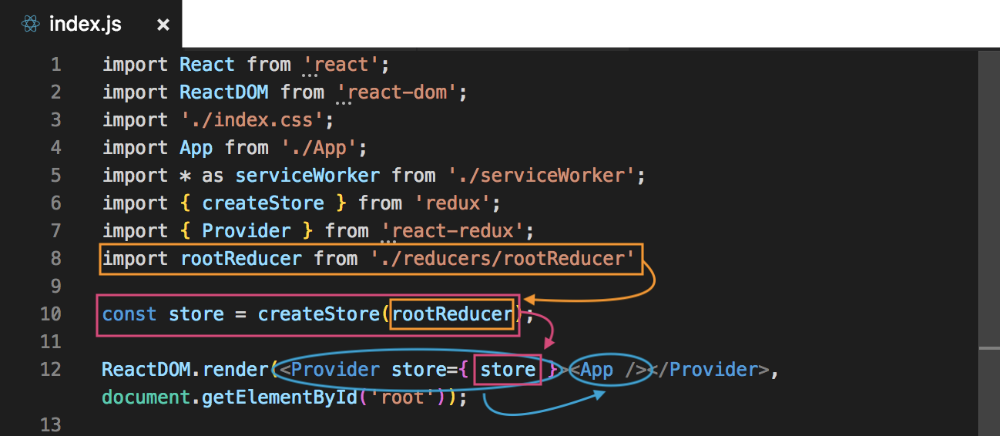
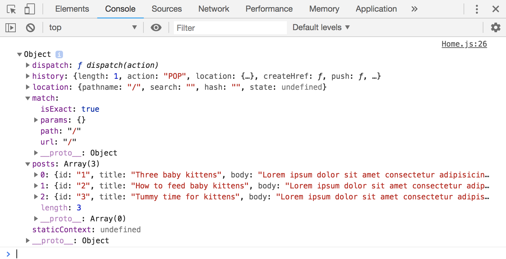
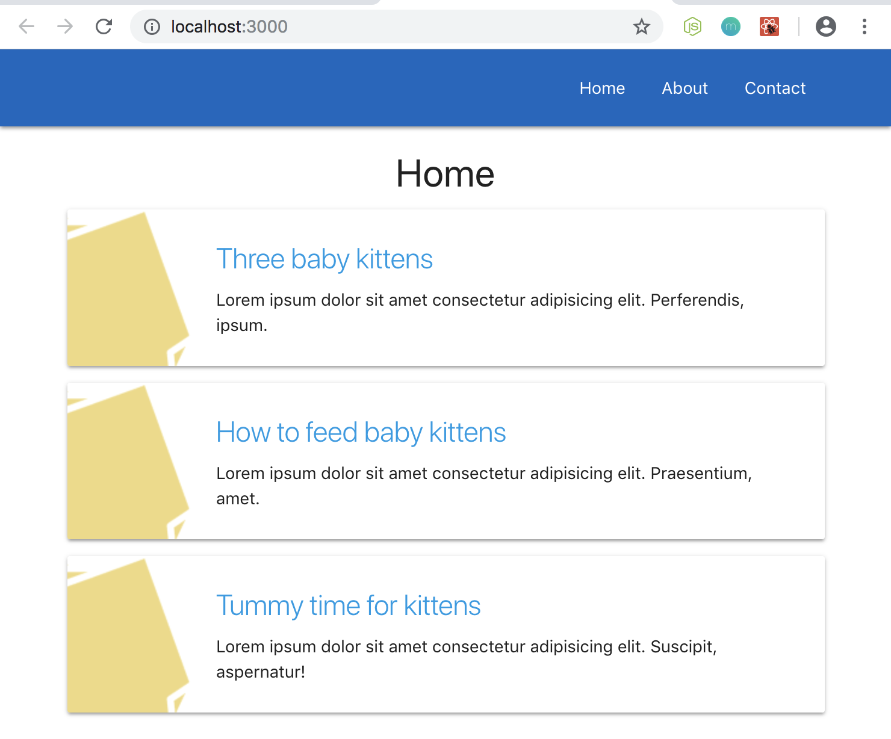
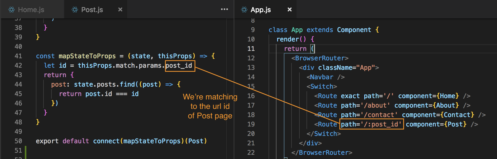
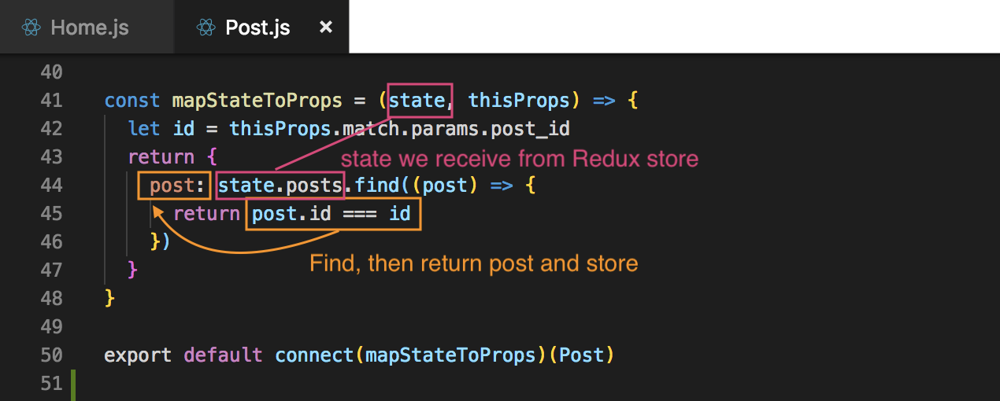

# Mapping ```state``` to ```props```

<kbd></kbd>

Earlier we finished creating the store and passed in the reducer, and we also provided the store we created in the Provider tag component, which is providing the store in turn to the App. So, we can access the store inside our React application.

Next, what we need to do is connect our components to the ```store``` so that we can interact with the ```state``` and get data from it.

Currently, the ```state``` is empty:

**rootReducer.js**
```
const initState = {
  posts: []
}
```

We should create some dummy data for this to play around with to start and interact with it via retrieving data.

**rootReducer.js**
```
const initState = {
  posts: [
    {id: '1', title: 'Three baby kittens', body: 'Lorem ipsum dolor sit amet consectetur adipisicing elit. Perferendis, ipsum.'},
    {id: '2', title: 'How to feed baby kittens', body: 'Lorem ipsum dolor sit amet consectetur adipisicing elit. Praesentium, amet.'},
    {id: '3', title: 'Tummy time for kittens', body: 'Lorem ipsum dolor sit amet consectetur adipisicing elit. Suscipit, aspernatur!'}
  ]
}
```

In the previous example, we're getting data from JSON Placeholder via axios. We don't want that anymore, we want to get it from our ```store```, the ```initState```.

Remove in **Home.js**:
```
state = {
  posts: [ ]
}
componentDidMount() {
  axios.get('https://jsonplaceholder.typicode.com/posts')
    .then(response => {
      // console.log(response) // test
      this.setState({
        posts: response.data.slice(0, 10)
      })
    })
}
```

Bc we're not gonna store the state in the component anymore. The whole point of Redux is to have a central store of data that each component can reach out to and grab data from.

Also, remove the import axios ```import axios from 'axios'``` from **Home.js**

## Connect Home.js Component to Redux Store

Remember the second library we installed, ```react-redux```, it's the bridge or glue layer, and we need to import a higher order component from that library, so that we can use that higher order component to connect this component with Redux store.

First we need to import it in Home.js: 
```
import { connect } from 'react-redux'
```

* **connect** - is actually a function, we need to invoke that function to bring back a higher order component. Ex.) ```export default connect()(Home)``` the ```connect()``` is returning the higher order component, then the HOC is wrapping the Home component. 

* **higher order components** - in the past when we were using it, we'd grab that higher order component and we wrap that component inside it, by passing the component as an argument into the higher order component. Ex.) ```export default connect(Home)```.

With ```export default connect()(Home)```, we're connecting our Home componet to our Redux store.

But, we still have to retrieve the data that we want from that Redux store.

## Map Data from Store to Props in Component

<kbd></kbd>

If a component wants access to that store, then we need to take some data from the store and we map that data down to the props of our component.

We have to create a function to do this, and lets call it ```mapStateToProps``` and use the arrow function and inside the parenthese ```()``` pass in ```state``` bc we get access to the state of the store. So, now we can grab stuff from the state and attach them to the props. We do that by returning and object inside the function. 

This object represents the different properties we want to add to the props. For instance, if we want to add a proeprty called ```posts```, it can be added and make it equal or give it value of ```state.posts```. You're taking the ```state``` of that store and the ```posts``` property from the store.

**rootReducer.js**
```
const initState = {
  posts: [
    {id: '1', title: 'Three baby kittens', body: 'Lorem ipsum dolor sit amet consectetur adipisicing elit. Perferendis, ipsum.'},
    {id: '2', title: 'How to feed baby kittens', body: 'Lorem ipsum dolor sit amet consectetur adipisicing elit. Praesentium, amet.'},
    {id: '3', title: 'Tummy time for kittens', body: 'Lorem ipsum dolor sit amet consectetur adipisicing elit. Suscipit, aspernatur!'}
  ]
}
```

**Home.js**
```
const mapStateToProps = (state) => {
  return {
    posts: state.posts
  }
}
```

So, we're data from the store's state, applying it to a property called posts, and then we're gonna map that to the props.

Next, we need to pass ```mapStateToProps``` inside the ```connect()``` function.

**Home.js**
```
const mapStateToProps = (state) => {
  return {
    posts: state.posts
  }
}

export default connect(mapStateToProps)(Home)
```

When we connect to Redux, it knows what data we want to grab from Redux with ```state.posts``` and the property that we want to create on our ```props``` object, ```posts```, that we want to apply that data to.

## Log Out ```props``` to See What We Get

Next, let's log out the ```props``` inside the component, so we can see that that ```posts``` object has been applied to the ```props``` in Home.js.

<kbd></kbd>

Where we log the props to the console, we have those Redux posts, the dummy data we created.

<kbd></kbd>

You'll notice now that the posts are the data from our Redux store bc we grabbed those from the props we recieve in ```const { posts } = this.props``` and we're cycling through those.

## Summary

All we're doing is importing the ```{ connect }``` function at the top and then invoking it at the bottom and passing in ```mapStateToProps``` function, that combination return a **higher order component** which wraps our **Home** component and gives it super powers like the ability to connect to Redux.

What we're doing inside of ```mapStateToProps``` function is taking the ```state``` as the parameter and it's of our Redux store and we're applying a ```posts``` property to our ```props``` and we're setting it to ```state.posts``` from our Redux store.

# Blog Post's Detail Page

We need to go to our Post.js component because that's where we setup the layout of the individual pages selected posts once clicked on in the Home page.

What we want to do is connect this Post component to our Redux store and get that individual item of post to show on the individual post page.

In Post.js remove the ```componentDidMoutn()``` section and the ```state```, also the reference to import axois at the top.

## Connect Post Component to Redux Store

To connect this component to the redux store, we need to import:

**Post.js**
```
import { connect } from 'react-redux'
```

At the bottom where we export, we want to use that ```connect``` higher order component, it's a function which returns a higher order component and wraps our Post component.

**Post.js**
```
export default connect()(Post)
```

Next, we'll need to create the function to map our state to props, above the export code.

**Post.js**
```
const mapStateToProps = (state) => {

}
```

Inside this function, we want to grab that single individual item that matches that post we clicked on. How do we do that? We can do that by adding a second parameter, let's call it ```thisProps``` and it's refering to the props of this Post component before we attach the additional props from the Redux store.

**Post.js**
```
const mapStateToProps = (state, thisProps) => {

}
```

So, our old props, they're going to have information about the Route, we can grab the ```id``` from the Route. Then we can use that ```id``` to find the 
specific post/blog that we want to connect to from the state of the Redux store.

We'll need to create another variable, use ```let``` to use those props to grab the ```id``` as ```let id = thisProps.match.params```. 

* ```thisProps.match.params``` - this is where we get the information about the wrap parameters.

The **wrap parameters** that we want is called ```post_id```. Remember, it's called this bc inside our App.js, in our ```<Route>``` tag, we called it ```path="/:post_id"```, when we setup the Route.

<kbd></kbd>

Next, we can return the object and remember, inside the return curly braces, is what we want to apply to our props for this component. For this component, we want an individual ```post``` and it's going to be equal to the ```state``` from the Redux store, add ```.posts```. Then, we want to find one individual post and we'll use the ```find()``` method to do that.

* ```find()``` - is a normal JavaScript method, used to check if an item matches what we're looking for.

Check if the post, that id is equal to the id of ```let id = thisProps.match.params.post_id```. The ```find()``` method is going to cycle through the posts on the state object and it's going to look at the id of each one. If that id matches ```let id = thisProps.match.params.post_id```, if that is true, then it's going to return that post bc that's what we want.

```find()``` will take the individual ```post``` as a callback function, then inside, we're going to return ```post.id === id```.

<kbd></kbd>

## Get the Matched Post id to Render

