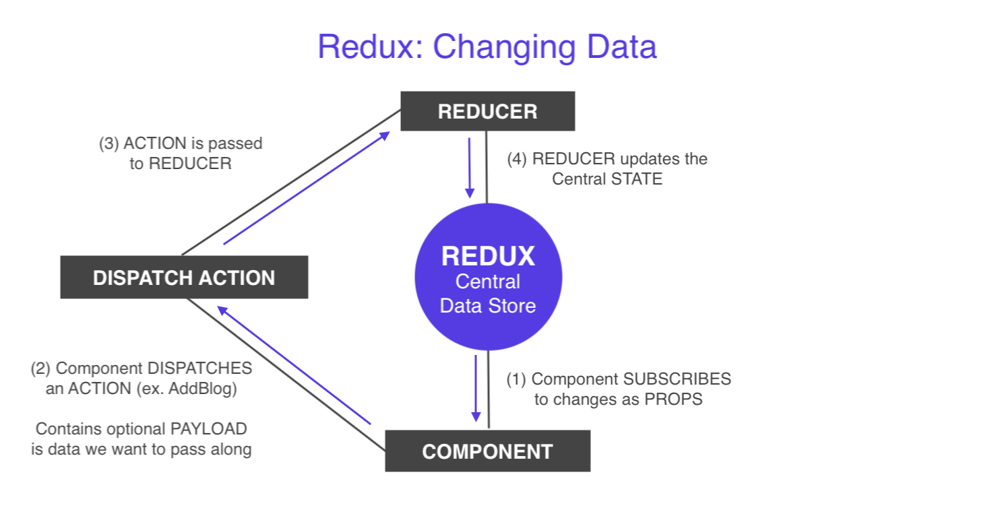

# Map Dispatch to Props

What if we want to change the ```state``` like deleting one of the posts?

Then, we need to interact with the state from the component.

<kbd></kbd>

Looking at our diagram, we have our state in the central store and we've already passed our data via the props to this component with the function ```mapStateToProps```.

If we want to make a change to the state, we have to **dispatch** and **action** from the component. That action is going to contain a **type**, eg. add post or delete post. Also, it can contain an option **payload**.

* So, if we're deleting a post, the payload could be the id of the post that we want to delete. Then, that delete action is dispatched to the reducer, the reducer takes the action, checks the type of action, takes in the payload, which in the case the post id that we want to delete from the state, and it makes that change to the central state. Then, when that changes, we get the updated props inside the component.

## How to Dispatch an Action from Component

Similar to our ```mapStateToProps``` function, this time, we'll have to ```mapDispatchToProps```.

* ```mapDispatchToProps``` - map our dispatches to our props, so that we can call them from our component

We'll create this function in our Post.js component.

It takes in a parameter, the ```disptach``` method. We're going to match dispatch to the component's props (different from our previous simple redux example with ```store.dispatch({type: ...})```). Instead, inside the function, we can say ```dispatch({})``` and the action inside the curly braces, we don't have to say ```store.dispatch({type:...})``` anymore.

What we want to do actually, is return an object and this object is going to represent similar to the ```mapStateToProps``` return object. But, in ```mapDispatchToProps```, we want to delete the matched post.

With ```deletePost```, we want it to dispatch an action, so it's going to be a function and it'll take a parameter of ```id``` of the post that we want to delete.

**Post.js**
```
deletePost: (id) => { dispatch({type: 'DELETE_POST', }) }
```

And the additional payload we want to send is the ```id```, so we need to create a property called id and set it to the id we receive inside the function when we call it.

**Post.js**
```
deletePost: (id) => { dispatch({type: 'DELETE_POST', id: id}) }
```

<kbd></kbd>

What we're doing is we're dispatching this action ```dispatch({type: 'DELETE_POST', id: id})``` when we call the ```deletePost``` function. This ```deletePost``` function is going to be attached to our props, so we can use it inside our component.

Before we do that, remember to pass ```mapDispatchToProps``` to the ```connect``` function down on the export line code. Make sure it's in this order: ```connect(mapStateToProps, mapDispatchToProps)(ComponentName)```.

**Log our props to the console**
<kbd></kbd>

We can see our ```deletePost``` function on the props object when we ```console.log(this.props)``` in the render() method. You can see that our ```deletePost``` function also expects an id. 

## Add Button so We Can Delete

**Post.js** in render() metho
```
const post = this.props.post ? (
  <div className="post">
    <h4 className="center">{this.props.post.title}</h4>
    <p>{this.props.post.body}</p>
    <div className="center">
      <button className="btn teal" onClick={this.handleClick}>
        Delete Post
      </button>
    </div>
  </div>
 ... 
```

We create a button in our JSX template and some Materialize class to create the button. We're gonna use the ```onClick={...}``` event with the ```handleClick``` function that we'll create later. We'll say ```this.handleClick``` and we're using ```this``` to refernce the component.

## Create the ```handleClick``` function for Delete Button

We're calling the ```deletePost``` method bc we want to delete the post. We also have to pass in an ```id``` bc this method is expecting an id bc we sent it inside the action in ```{ dispatch({type: 'DELETE_POST', id: id}) }```.

If you look at the post property inside the logged props object, you see that we also have an ```id``` property, so we grab it by saying ```this.props.post.id```, we're passing the id of that post into this ```handleClick``` function.

<kbd></kbd>

```
handleClick = () => {
  this.props.deletePost(this.props.post.id)
}
```

So, what we're doing is calling the ```handleClick``` function, which in turns firing the function of ```(id) =>``` inside ```deletePost``` that's inside ```mapDispatchToProps``` function. We're making a dispatch and sending this action ```{type: 'DELETE_POST', id: id}``` the  rootReducer where we recieve the action.

Whenever the action is dispatched, like whenever we click on that Delete Button, then, it's going to receive the action in ```rootReducer```. 

**rootReducer.js**
```
const rootReducer = (state = initState, action) => {
  return state;
} 
```

To just see what's going on, let's log it into the console:

<kbd></kbd>

## Delete the Post onClick

We need to check the type of action bc we don't want to delete it for every action, only if the action type is ```'DELETE_POST'```.

So, if ```action.type == 'DELETE_POST'```, we're going to update the state in the Redux store. Remember, when we update the state, we don't want to do anything destructive to the original state. We'll use the ```filter()``` method bc it doesn't alter the original array, rather, it creates a new array.

```let newPosts = state.posts.filter()``` and we're gonna filter through the posts. The filter method performs a functions on each individual post, and if we return true for that function, then we keep that post in the the ```newPosts``` array. If it's false, then we filter that post out of the newPost array, it doesn't get added in.

To reiterate, this callback function inside the filter method take the individual post that we're cycling through and what we want to do is check, does this ```post``` id in the callback equal to the id we receive on the action? If it does equal the same thing, then what we want to do is return false bc that will filter out, if they are the same. We want to return true if the action id and the post id are not equal.

So, this ```action.id !== post.id``` is going to be true if the ids are not the the same.

We get the id on the action bc we passed it in Post.js in the ```mapDispatchToProps``` inside the dispatch method as the second parameter.

Next, we need to return a new object which represents the new state. We want to take the current state and we want to spread it ```...state``` so that all of the property from the state are returned inside the object first, and then we overwrite with ```post: newPosts``` the post property with ```newPosts```.

**Initial state**
<kbd></kbd>
We have all our initial state of dummy data from the Redux store.

<kbd></kbd>
There's still info of the micro blog post, data from the Redux store.

**After onClick Delete**
<kbd></kbd>
When you click on the Delete button, the content is gone.

<kbd></kbd>
Go back to the Home page, the post is gone.

## Redirect to the Home Page After Clicking to Delete

Do it inside the Post.js component in the ```handleClick``` function, after the ```this.props.deletePost(this.props.post.id)```, we'll add ```this.props.history``` and then use the method ```push()``` and redirect by adding the link to the path inside the push methond parantheses. For this example, we want to redirect to the Home page, which is ```'/'``` to get to the Home page.

